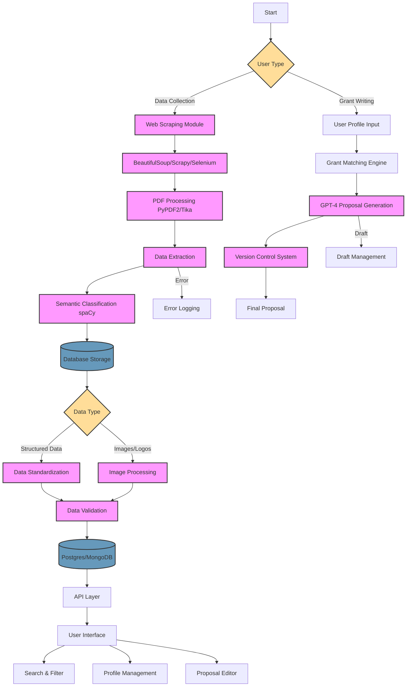
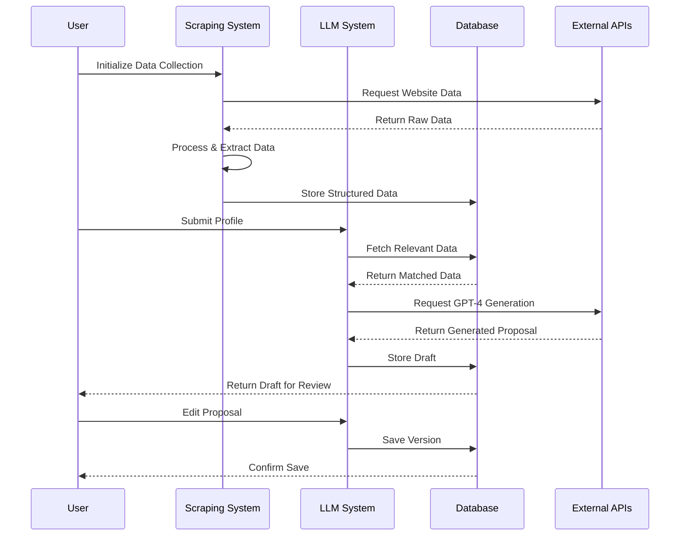
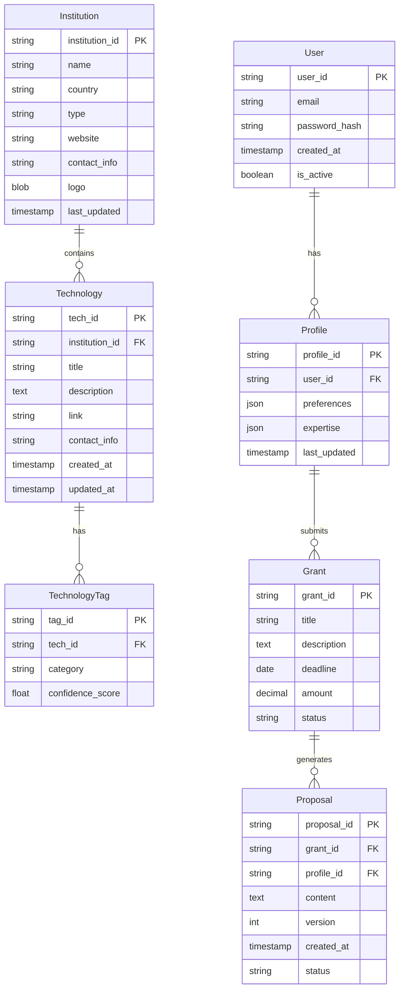
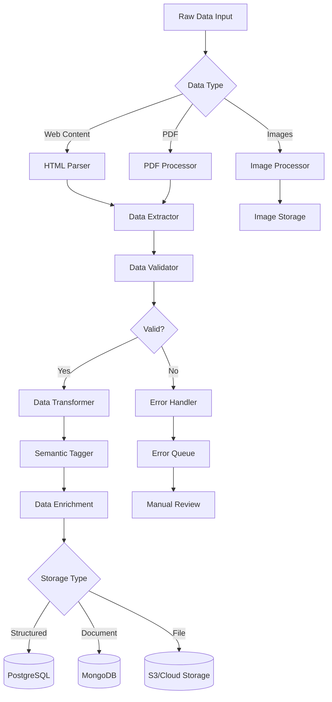
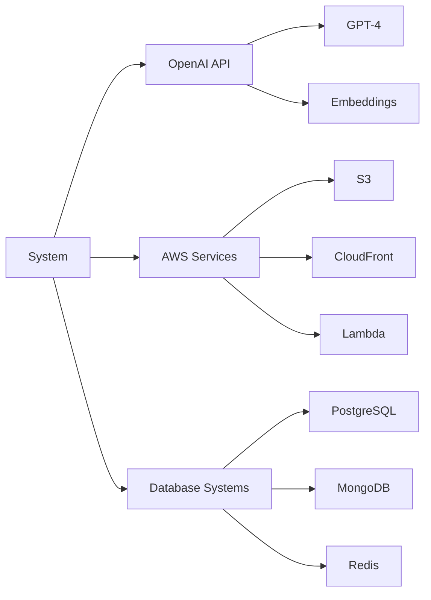

# Product Requirements Document (PRD)

# 1. INTRODUCTION

## 1.1 Purpose

This Software Requirements Specification (SRS) document provides a comprehensive description of the implementation requirements for an integrated technology transfer data aggregation and grant-writing assistance system. It serves as the primary reference for technical teams, stakeholders, and project managers involved in development and deployment.

## 1.2 Scope

The system encompasses two primary components:

1. **Technology Transfer Data Aggregation System**

   - Automated web scraping of 375+ institutions
   - Data extraction from websites and PDF documents
   - Semantic classification and tagging
   - Structured data storage and organization
   - Institution coverage:
     - 200 U.S. universities
     - 100 international universities
     - 75 U.S. federal research labs/agencies

2. **Grant-Writing LLM Application**

   - Grant opportunity matching
   - Automated proposal generation
   - Recommendation scoring system
   - Version-controlled proposal editing
   - Profile-based customization

### Key Benefits

- Centralized access to global technology transfer opportunities
- Automated, intelligent grant proposal generation
- Semantic search and matching capabilities
- Streamlined grant application workflow
- Time and resource optimization for users

### Core Functionalities

| Component | Primary Functions |
| --- | --- |
| Data Aggregation | - Multi-source web scraping - PDF parsing - Semantic tagging - Data standardization |
| Grant-Writing | - Profile-based recommendations - Proposal generation - Match scoring - Draft management |
| Integration | - Data synchronization - User profile management - Secure storage - API interfaces |

# 2. PRODUCT DESCRIPTION

## 2.1 Product Perspective

The integrated technology transfer data aggregation and grant-writing assistance system operates as a cloud-based SaaS solution within the broader research and innovation ecosystem. The system interfaces with:

- University and research institution websites
- Federal laboratory databases
- Grant-making organization platforms
- User authentication systems
- Cloud storage services (AWS/GCP)
- Database management systems (Postgres/MongoDB)

## 2.2 Product Functions

| Function Category | Key Capabilities |
| --- | --- |
| Data Collection | - Multi-source web scraping with BeautifulSoup, Scrapy, and Selenium - PDF document parsing using PyPDF2/Apache Tika - Automated data extraction and standardization - Logo and image collection |
| Data Processing | - Semantic classification using spaCy - Multi-language content processing - Metadata extraction and tagging - Data validation and error handling |
| Grant Management | - Profile-based grant matching - Automated proposal generation via GPT-4 - Version-controlled document management - Match scoring and recommendations |
| User Interface | - Customizable user profiles - Grant proposal editor - Search and filtering capabilities - Progress tracking dashboard |

## 2.3 User Characteristics

### Primary User Personas

1. **Research Entrepreneurs**

   - Technical expertise: High
   - Domain knowledge: Specialized
   - Usage frequency: Regular
   - Primary need: Technology scouting

2. **Grant Writers**

   - Technical expertise: Moderate
   - Domain knowledge: Broad
   - Usage frequency: High
   - Primary need: Proposal automation

3. **Technology Transfer Officers**

   - Technical expertise: Moderate
   - Domain knowledge: High
   - Usage frequency: Regular
   - Primary need: Opportunity discovery

## 2.4 Constraints

1. **Technical Constraints**

   - Website access limitations and CAPTCHA systems
   - API rate limits
   - Processing capacity for PDF parsing
   - LLM token limitations
   - Storage capacity for document versions

2. **Regulatory Constraints**

   - Data privacy compliance (GDPR, CCPA)
   - Website terms of service adherence
   - Grant submission regulations
   - Intellectual property restrictions

3. **Business Constraints**

   - Cloud service cost limitations
   - LLM API usage costs
   - Development timeline requirements
   - Resource allocation restrictions

## 2.5 Assumptions and Dependencies

### Assumptions

1. Target institutions maintain stable website structures
2. PDF documents follow standard formatting
3. Users have basic technical proficiency
4. Internet connectivity is consistently available
5. Cloud services maintain high availability

### Dependencies

1. External Services

   - OpenAI GPT-4 API availability
   - Cloud platform services
   - Database management systems
   - Authentication services

2. Data Sources

   - University technology transfer offices
   - Federal laboratory websites
   - Grant-making organizations
   - Research institution databases

3. Technical Infrastructure

   - Web scraping framework compatibility
   - PDF parsing library maintenance
   - NLP model updates
   - Database system updates

# 3. PROCESS FLOWCHART

# 4. FUNCTIONAL REQUIREMENTS

## 4.1 Data Collection Features

### F1: Web Scraping Engine

**ID:** DCF-001  
**Description:** Automated collection of technology transfer data from institutional websites  
**Priority:** High

| Requirement ID | Description | Priority |
| --- | --- | --- |
| DCF-001.1 | Implement BeautifulSoup/Scrapy/Selenium scrapers for 375+ institutions | High |
| DCF-001.2 | Extract standardized fields (Institution, Title, Description, etc.) | High |
| DCF-001.3 | Handle dynamic content loading and JavaScript rendering | Medium |
| DCF-001.4 | Implement rate limiting and request throttling | High |

### F2: PDF Processing

**ID:** DCF-002  
**Description:** Extraction and parsing of PDF documents containing technology information  
**Priority:** High

| Requirement ID | Description | Priority |
| --- | --- | --- |
| DCF-002.1 | Implement PyPDF2/Apache Tika for document parsing | High |
| DCF-002.2 | Extract structured data from standardized PDF formats | High |
| DCF-002.3 | Handle multiple PDF layouts and formats | Medium |
| DCF-002.4 | Extract tables and formatted content | Medium |

## 4.2 Data Processing Features

### F3: Semantic Classification

**ID:** DPF-001  
**Description:** Classification and tagging of collected technology data  
**Priority:** High

| Requirement ID | Description | Priority |
| --- | --- | --- |
| DPF-001.1 | Implement spaCy-based classification system | High |
| DPF-001.2 | Generate industry and technology tags | High |
| DPF-001.3 | Support multi-language classification | Medium |
| DPF-001.4 | Maintain taxonomy dictionary | Medium |

### F4: Data Storage

**ID:** DPF-002  
**Description:** Structured storage of collected and processed data  
**Priority:** High

| Requirement ID | Description | Priority |
| --- | --- | --- |
| DPF-002.1 | Store structured data in Postgres/MongoDB | High |
| DPF-002.2 | Implement data versioning | Medium |
| DPF-002.3 | Store image assets in dedicated storage | Medium |
| DPF-002.4 | Implement backup and recovery systems | High |

## 4.3 Grant-Writing Features

### F5: Grant Matching

**ID:** GWF-001  
**Description:** Matching users with relevant grant opportunities  
**Priority:** High

| Requirement ID | Description | Priority |
| --- | --- | --- |
| GWF-001.1 | Implement profile-based matching algorithm | High |
| GWF-001.2 | Calculate and display match scores | High |
| GWF-001.3 | Filter matches by criteria (deadline, amount, etc.) | Medium |
| GWF-001.4 | Provide match explanations | Low |

### F6: Proposal Generation

**ID:** GWF-002  
**Description:** Automated generation of grant proposals using GPT-4  
**Priority:** High

| Requirement ID | Description | Priority |
| --- | --- | --- |
| GWF-002.1 | Generate proposal drafts using GPT-4 | High |
| GWF-002.2 | Incorporate user profile data | High |
| GWF-002.3 | Support multiple proposal formats | Medium |
| GWF-002.4 | Implement version control for drafts | High |

## 4.4 User Interface Features

### F7: Search and Discovery

**ID:** UIF-001  
**Description:** Interface for searching and filtering technology transfer data  
**Priority:** High

| Requirement ID | Description | Priority |
| --- | --- | --- |
| UIF-001.1 | Implement advanced search functionality | High |
| UIF-001.2 | Provide filtering by multiple criteria | High |
| UIF-001.3 | Display search results with pagination | Medium |
| UIF-001.4 | Support saved searches | Low |

### F8: Profile Management

**ID:** UIF-002  
**Description:** User profile creation and management interface  
**Priority:** High

| Requirement ID | Description | Priority |
| --- | --- | --- |
| UIF-002.1 | Create and edit user profiles | High |
| UIF-002.2 | Store preference settings | Medium |
| UIF-002.3 | Manage saved proposals | Medium |
| UIF-002.4 | Track application history | Low |

# 5. NON-FUNCTIONAL REQUIREMENTS

## 5.1 Performance Requirements

| Requirement | Specification | Priority |
| --- | --- | --- |
| Response Time | - Web scraping: \< 30 seconds per institution - Search queries: \< 2 seconds - LLM proposal generation: \< 60 seconds - PDF parsing: \< 15 seconds per document | High |
| Throughput | - Support 1000+ concurrent users - Process 100+ simultaneous scraping jobs - Handle 500+ API requests per minute | High |
| Resource Usage | - CPU utilization \< 80% - Memory usage \< 16GB per server instance - Storage scaling up to 10TB - Network bandwidth: 1Gbps | Medium |

## 5.2 Safety Requirements

| Category | Requirements | Priority |
| --- | --- | --- |
| Data Backup | - Automated daily backups - Point-in-time recovery capability - Backup retention for 30 days - Geographic redundancy | High |
| Failure Recovery | - Automatic failover mechanisms - Data consistency checks - Transaction rollback capabilities - System state monitoring | High |
| Error Handling | - Graceful degradation of services - User notification systems - Error logging and monitoring - Automated error reporting | Medium |

## 5.3 Security Requirements

| Feature | Specification | Priority |
| --- | --- | --- |
| Authentication | - Multi-factor authentication - OAuth 2.0 integration - Session management - Password policy enforcement | High |
| Authorization | - Role-based access control (RBAC) - API key management - Resource-level permissions - Access audit logging | High |
| Data Protection | - AES-256 encryption at rest - TLS 1.3 for data in transit - Key rotation policies - PII data masking | High |
| Privacy | - GDPR compliance mechanisms - Data anonymization - Consent management - Privacy policy enforcement | High |

## 5.4 Quality Requirements

### 5.4.1 Availability

- System uptime: 99.9%
- Planned maintenance windows: \< 4 hours monthly
- Recovery Time Objective (RTO): \< 2 hours
- Recovery Point Objective (RPO): \< 15 minutes

### 5.4.2 Maintainability

- Modular architecture with microservices
- Automated deployment pipelines
- Comprehensive API documentation
- Code coverage \> 80%

### 5.4.3 Usability

- Mobile-responsive design
- Accessibility compliance (WCAG 2.1)
- Maximum 3 clicks to core functions
- Intuitive navigation structure

### 5.4.4 Scalability

- Horizontal scaling capability
- Auto-scaling based on load
- Database sharding support
- Content Delivery Network integration

### 5.4.5 Reliability

- Mean Time Between Failures (MTBF): \> 720 hours
- Mean Time To Repair (MTTR): \< 2 hours
- Error rate: \< 0.1%
- Data accuracy: \> 99%

## 5.5 Compliance Requirements

| Regulation/Standard | Requirements | Priority |
| --- | --- | --- |
| Data Privacy | - GDPR compliance - CCPA compliance - Privacy Shield Framework - Data processing agreements | High |
| Security Standards | - SOC 2 Type II certification - ISO 27001 compliance - NIST Cybersecurity Framework - Regular security audits | High |
| Web Standards | - W3C compliance - WCAG 2.1 accessibility - RFC standards adherence - HTML5/CSS3 validation | Medium |
| API Standards | - OpenAPI Specification - REST architectural style - OAuth 2.0 authentication - Rate limiting compliance | Medium |

# 6. DATA REQUIREMENTS

## 6.1 Data Models

## 6.2 Data Storage

### 6.2.1 Primary Storage Systems

| Data Type | Storage System | Purpose |
| --- | --- | --- |
| Structured Data | PostgreSQL | User profiles, institutions, technologies |
| Document Storage | MongoDB | Grant proposals, version history |
| File Storage | S3/Cloud Storage | PDFs, logos, attachments |
| Cache Layer | Redis | Session data, frequent queries |

### 6.2.2 Data Retention

| Data Category | Retention Period | Archive Strategy |
| --- | --- | --- |
| User Data | 7 years | Cold storage after 2 years |
| Proposals | 5 years | Compressed archive after 1 year |
| Technology Data | Indefinite | Versioned history |
| System Logs | 90 days | Archived to cold storage |

### 6.2.3 Backup and Recovery

| Component | Backup Frequency | Recovery SLA |
| --- | --- | --- |
| PostgreSQL | Hourly incremental, Daily full | 2 hours |
| MongoDB | Continuous replication | 1 hour |
| File Storage | Daily incremental | 4 hours |
| Redis Cache | Real-time replication | 15 minutes |

## 6.3 Data Processing

### 6.3.1 Data Security Controls

| Security Layer | Implementation |
| --- | --- |
| Encryption at Rest | AES-256 encryption |
| Transport Security | TLS 1.3 |
| Access Control | Role-based access with JWT |
| Data Masking | PII identification and encryption |
| Audit Logging | All data modifications tracked |

### 6.3.2 Data Quality Controls

| Control Type | Implementation |
| --- | --- |
| Validation | Schema validation, data type checking |
| Deduplication | Hash-based duplicate detection |
| Standardization | Field normalization rules |
| Completeness | Required field enforcement |
| Accuracy | Automated data verification |

### 6.3.3 Data Processing SLAs

| Process | Maximum Duration | Throughput |
| --- | --- | --- |
| Web Scraping | 30 seconds/page | 100 pages/minute |
| PDF Processing | 15 seconds/document | 240 documents/hour |
| Image Processing | 5 seconds/image | 720 images/hour |
| Data Enrichment | 10 seconds/record | 360 records/hour |

# 7. EXTERNAL INTERFACES

## 7.1 User Interfaces

### 7.1.1 Web Application Interface

| Interface Component | Description | Requirements |
| --- | --- | --- |
| Dashboard | Main control center | - Responsive design (Bootstrap 5) - Dark/light mode toggle - Real-time updates - Customizable widgets |
| Search Interface | Technology search portal | - Advanced filtering options - Auto-complete suggestions - Results pagination - Save search functionality |
| Grant Writer | Proposal creation workspace | - Rich text editor - Version history viewer - Split-screen preview - Auto-save feature |
| Profile Manager | User profile configuration | - Form-based input - Profile completeness indicator - Preference management - Integration settings |

### 7.1.2 Mobile Interface

| Feature | Requirements |
| --- | --- |
| Responsive Layout | - Bootstrap breakpoints - Touch-optimized controls - Mobile-first design principles |
| Progressive Loading | - Lazy loading of images - Infinite scroll support - Optimized asset delivery |
| Offline Capabilities | - Service worker integration - Local storage management - Sync queue for updates |

## 7.2 Hardware Interfaces

### 7.2.1 Server Requirements

| Component | Specifications |
| --- | --- |
| Processing | - Multi-core CPU support - GPU acceleration for ML tasks - Load balancing capability |
| Storage | - SSD for primary storage - NAS/SAN integration - RAID configuration |
| Network | - 10Gbps network interface - Multiple NIC support - Hardware firewall compatibility |

### 7.2.2 Client Requirements

| Device Type | Minimum Specifications |
| --- | --- |
| Desktop/Laptop | - Modern web browser - 4GB RAM - 1024x768 resolution |
| Mobile Devices | - iOS 14+ or Android 10+ - WebView support - Touch screen capability |

## 7.3 Software Interfaces

### 7.3.1 External Services Integration

| Service | Interface Type | Purpose |
| --- | --- | --- |
| OpenAI API | REST API | - Proposal generation - Content analysis - Semantic processing |
| AWS Services | SDK/API | - File storage - CDN distribution - Serverless functions |
| Database Systems | Native Drivers | - Data persistence - Cache management - Session handling |

### 7.3.2 Third-Party Integrations

| Integration | Protocol | Data Format |
| --- | --- | --- |
| Authentication | OAuth 2.0 | JWT tokens |
| Payment Processing | REST API | JSON/XML |
| Email Service | SMTP/API | MIME/JSON |
| Analytics | REST API | JSON |

## 7.4 Communication Interfaces

### 7.4.1 Network Protocols

| Protocol | Usage | Specifications |
| --- | --- | --- |
| HTTPS | Primary API communication | - TLS 1.3 - Certificate pinning - HSTS enabled |
| WebSocket | Real-time updates | - WSS protocol - Heartbeat monitoring - Auto-reconnect |
| GraphQL | Data querying | - Schema validation - Query batching - Caching support |

### 7.4.2 API Specifications

| API Type | Format | Features |
| --- | --- | --- |
| REST API | JSON | - OpenAPI 3.0 specification - Rate limiting - Versioning - CORS support |
| WebSocket API | JSON/Binary | - Compression support - Message queuing - Error handling |
| Internal API | Protocol Buffers | - Binary serialization - Schema evolution - RPC support |

### 7.4.3 Data Exchange Formats

| Format | Use Case | Validation |
| --- | --- | --- |
| JSON | API responses | JSON Schema |
| CSV | Data exports | RFC 4180 |
| XML | Legacy systems | XSD Schema |
| Protocol Buffers | Internal communication | Proto3 Schema |

# 8. APPENDICES

## 8.1 GLOSSARY

| Term | Definition |
| --- | --- |
| Technology Transfer | The process of transferring scientific findings, technologies, and innovations from research institutions to the commercial market |
| Semantic Tagging | The process of adding metadata tags to content based on its meaning and context |
| Match Score | A numerical value indicating the relevance of a grant opportunity to a user's profile |
| Web Scraping | Automated extraction of data from websites using specialized software tools |
| Version Control | System for tracking and managing changes to documents or code over time |
| Cold Storage | Low-cost storage solution for infrequently accessed data |
| Data Enrichment | Process of enhancing data with additional relevant information from other sources |
| Content Delivery Network (CDN) | Distributed network of servers that delivers web content to users based on geographic location |

## 8.2 ACRONYMS

| Acronym | Full Form |
| --- | --- |
| API | Application Programming Interface |
| AWS | Amazon Web Services |
| CCPA | California Consumer Privacy Act |
| CDN | Content Delivery Network |
| CORS | Cross-Origin Resource Sharing |
| CPU | Central Processing Unit |
| CSV | Comma-Separated Values |
| GDPR | General Data Protection Regulation |
| GPU | Graphics Processing Unit |
| HSTS | HTTP Strict Transport Security |
| HTML | HyperText Markup Language |
| JWT | JSON Web Token |
| LLM | Large Language Model |
| MIME | Multipurpose Internet Mail Extensions |
| NAS | Network Attached Storage |
| NIC | Network Interface Card |
| PDF | Portable Document Format |
| PII | Personally Identifiable Information |
| RAID | Redundant Array of Independent Disks |
| REST | Representational State Transfer |
| RFC | Request for Comments |
| RPC | Remote Procedure Call |
| SAN | Storage Area Network |
| SDK | Software Development Kit |
| SLA | Service Level Agreement |
| SMTP | Simple Mail Transfer Protocol |
| SSD | Solid State Drive |
| TLS | Transport Layer Security |
| URL | Uniform Resource Locator |
| W3C | World Wide Web Consortium |
| WCAG | Web Content Accessibility Guidelines |
| WSS | WebSocket Secure |
| XML | Extensible Markup Language |
| XSD | XML Schema Definition |

## 8.3 ADDITIONAL REFERENCES

| Category | Reference |
| --- | --- |
| Web Scraping | - BeautifulSoup Documentation: https://www.crummy.com/software/BeautifulSoup/bs4/doc/ - Scrapy Documentation: https://docs.scrapy.org/ - Selenium Documentation: https://www.selenium.dev/documentation/ |
| PDF Processing | - PyPDF2 Documentation: https://pypdf2.readthedocs.io/ - Apache Tika Documentation: https://tika.apache.org/documentation.html |
| NLP & ML | - spaCy Documentation: https://spacy.io/api/ - OpenAI API Documentation: https://platform.openai.com/docs/ |
| Database | - PostgreSQL Documentation: https://www.postgresql.org/docs/ - MongoDB Documentation: https://docs.mongodb.com/ |
| Security Standards | - NIST Cybersecurity Framework: https://www.nist.gov/cyberframework - OWASP Security Guidelines: https://owasp.org/www-project-web-security-testing-guide/ |
| Accessibility | - WCAG 2.1 Guidelines: https://www.w3.org/WAI/standards-guidelines/wcag/ - Section 508 Compliance: https://www.section508.gov/ |
| API Design | - OpenAPI Specification: https://swagger.io/specification/ - REST API Best Practices: https://restfulapi.net/ |

1. 1. Sites to scrape 

   2. starting_url

      https://techfinder.stanford.edu/

      https://tlo.mit.edu/industry-entrepreneurs/available-technologies

      https://techtransfer.universityofcalifornia.edu/default?campus=BK

      Index - Center for Technology Transfer and Enterprise Creation - Carnegie Mellon University (cmu.edu)

      https://utotc.technologypublisher.com/

      https://otd.harvard.edu/industry-investors/commercialization-opportunities/

      https://otm.illinois.edu/technologies

      https://licensing.research.gatech.edu/technologies

      https://available-inventions.umich.edu/

      https://techtransfer.universityofcalifornia.edu/Categories?campus=LA

      https://usc.flintbox.com/technologies

      https://otc.duke.edu/technologies/

      https://nulive.technologypublisher.com/

      https://upenn.technologypublisher.com/

      https://inventions.techventures.columbia.edu/categories

      https://innovation.ucsd.edu/commercialize/index.html

      https://www.warf.org/commercialize/technologies/

      https://otc.unc.edu/technologies/

      https://technologylicensing.utah.edu/technologies

      https://research.rice.edu/ott/available-technologies

      https://dartmouth.flintbox.com/technologies

      https://colorado-boulder.portals.in-part.com/

      https://lvg.virginia.edu/technologies

      https://research.ucdavis.edu/technology-transfer/available-technologies/

      https://ufinnovate.technologypublisher.com/

      https://uga.flintbox.com/technologies

      https://oied.osu.edu/find-technologies

      https://nutech.flintbox.com/technologies

      https://invent.psu.edu/tools/intellectual-property-navigator/

      https://inventions.prf.org/

      https://sc.edu/about/offices_and_divisions/technology_commercialization/for_industry/browse/index.php

      https://utrf.tennessee.edu/industry/available-technologies/

      https://tamus.flintbox.com/technologies

      https://rochester.technologypublisher.com/

      https://vtip.technologypublisher.com/

      https://school.wakehealth.edu/innovations/technology-for-license

      https://case.edu/bme/translation-and-innovation/available-technologies

      https://www.research.fsu.edu/research-offices/oc/technologies/

      https://northeastern.portals.in-part.com/

      https://license.umn.edu/

      https://www.wm.edu/offices/techtransfer/featuredtechnology/

      https://www.stonybrook.edu/commcms/ipp/innovations/index.php

      https://uconn.flintbox.com/technologies

      https://www.brandeis.edu/innovation/for-industry/technologies-available-from-brandeis.html

      https://msut.technologypublisher.com/

      https://invent.psu.edu/tools/intellectual-property-navigator/

      https://ipo.rpi.edu/technologies-available-licensing

      https://www.ucop.edu/innovation-transfer-operations/innovation/available-technologies.html

      https://technologies.research.gwu.edu/

      https://techtransfer.syr.edu/industry/intellectual-property-available-for-licensing/

      https://tto-umass-amherst.technologypublisher.com/

      https://miami.flintbox.com/technologies

      https://www.oiep.pitt.edu/sites/default/files/opportunities_report\_-\_september_2023_pdf.pdf

      https://binghamton.technologypublisher.com/

      https://iu.flintbox.com/technologies

      https://research.tulane.edu/technologies-available-licensing

      https://research.mines.edu/available-technologies/

      https://stevens.technologypublisher.com/

      https://buffalo.technologypublisher.com/

      https://www.ucop.edu/innovation-transfer-operations/innovation/available-technologies.html

      https://udel.flintbox.com/technologies%20

      https://techfinder.rutgers.edu/

      https://www.ucop.edu/innovation-transfer-operations/innovation/available-technologies.html

      https://otm.uic.edu/available-technologies/

      https://wpi.portals.in-part.com/?\_gl=1\*1lqxph9\*\_gcl_au\*MTg1NTMzNDI1NS4xNzIxOTQyNzE3\*\_ga\*MTkzODI4ODYyNC4xNzIxOTQyNzE3\*\_ga_RE35PKQB7J\*MTcyMTk0MjcxNy4xLjAuMTcyMTk0MjcxNy42MC4wLjA.

      https://curf.clemson.edu/available-technology/

      https://www.marquette.edu/university-relations/economic-engagement/for-our-partners.php

      https://research.njit.edu/available-technologies

      https://smutechnologies.flintbox.com/categories

      https://tuportal6.temple.edu/html/TEMPLE/apps/tup/Public/Research/LicensingOpportunities/

      https://usf.technologypublisher.com/?\_gl=1\*1d4jqhc\*\_ga\*MjA5ODgwNTc5My4xNzIyMDA5NTE5\*\_ga_2GYRWBBMJM\*MTcyMjAwOTUxOS4xLjAuMTcyMjAwOTUyMC4wLjAuMA..

      https://cws.auburn.edu/OVPR/pm/tt/availabletechnologies

      https://iti.uiowa.edu/research-technology/technology-transfer

      https://drexel.edu/applied-innovation/about/available-technologies/

      https://iit.flintbox.com/technologies

      https://www.rit.edu/iptt/technologies-available-licensing

      https://techfinder.rutgers.edu/

      https://uoregon.technologypublisher.com/

      https://calpoly.technologypublisher.com/

      https://research.sdsu.edu/tto/availabletechnologies

      https://www.csus.edu/experience/innovation-creativity/oried/innovation-technology-transfer/available-licensing.html

      https://www.cuny.edu/research/innovation-entrepreneurship/tco/available-technologies/

      https://ott.gmu.edu/resources/

      https://www.slu.edu/research/faculty-resources/research-innovation-group/index.php

      https://utrf.tennessee.edu/industry/available-technologies/

      https://techtransfer.byu.edu/search

      https://howard.portals.in-part.com/

      https://suny.technologypublisher.com/?keywords=Technologies

      https://inventions.arizona.edu/?\_gl=1\*cmcmlc\*\_gcl_au\*MzY0NzIwNjE0LjE3MjIzODAyMjQ.\*\_ga\*NzE3MjUxNTEuMTcyMjM4MDIyNA..\*\_ga_7PV3540XS3\*MTcyMjM4MDIyNC4xLjAuMTcyMjM4MDIyNC4wLjAuMTg4Njk2NDI4MQ..

      https://t2.unh.edu/resources/all

      https://techtransfer.universityofcalifornia.edu/default?campus=SF

      https://technologylicensing.utah.edu/technologies

      https://www.albany.edu/research-economic-development/entrepreneurship-innovation

      https://puotl.technologypublisher.com/

      https://ventures.yale.edu/yale-technologies

      https://brown.technologypublisher.com/

      https://ventures.jhu.edu/innovations/technologies/

      https://uchicago.technologypublisher.com/?utm_campaign=Technology+Publisher&utm_medium=bitly&utm_source=websitetopnav

      https://ctl.cornell.edu/industry/#searchtech

      https://innovation.caltech.edu/patents-licensing

      https://license.tov.med.nyu.edu/

      https://cttc.co/technologies

      https://www.bu.edu/industry/industry-action-guide/technologies-available-for-license/

      https://notredametech.technologypublisher.com/

      https://ott.emory.edu/industry/listings.html

      https://georgetown.flintbox.com/technologies

      https://tech.wustl.edu/?\_gl=1%2A1tg1ixq%2A_ga%2ANDIxMzIzODg1LjE3MjI1MzgxNDU.%2A_ga_GE3BQGVQ8T%2AMTcyMjUzODE0NC4xLjAuMTcyMjUzODE0Ni4wLjAuMA..

      https://www.umventures.org/technologies

      https://utdallas.technologypublisher.com/

      https://tia.ucsb.edu/find-technologies/

      https://techtransfer.universityofcalifornia.edu/default?campus=IR

      https://techtransfer.universityofcalifornia.edu/default?campus=RV

      https://uaventures.flintbox.com/technologies

      https://uh.edu/uh-energy-innovation/uh-innovation/technology-transfer/

      https://louisville.edu/research/partners/licensing/available-technologies

      https://udayton.edu/research/resourcesforresearchers/tpo/technologies/index.php

      https://www.pomona.edu/administration/academic-dean/research/grant-policies/intellectual-property-policies

      https://carleton.ca/ips/licensing-opportunities/

      https://viceprovost.tufts.edu/technology-publisher

      https://techtransfer.lehigh.edu/technologies

      https://uc.technologypublisher.com/

      https://www.du.edu/techtransfer/industry

      https://southalabama.technologypublisher.com/

      https://wsu.technologypublisher.com/

      https://bc.flintbox.com/technologies

      https://www.uaf.edu/oipc/

      https://www.nmt.edu/oic/invention-summaries.php

      https://tech.missouri.edu/UREF2517E6A363B5DB4FA95FA2E9DD4F74F4/TF_Home/A11155563090

      https://ua.technologypublisher.com/

      https://colorado.flintbox.com/technologies

      https://isurftech.technologypublisher.com/

      https://iu.flintbox.com/technologies

      https://skysonginnovations.com/?s=

      Technologies for License | Industry Engagement (bu.edu)

      https://sponsored-research.catholic.edu/ott/patents/index.html

      Available Technologies | Cleveland State University (csuohio.edu)

      Available Technologies - CSU STRATA

      https://fau.technologypublisher.com/

      Technologies Available for Licensing - Research (fiu.edu)

      isurftech.technologypublisher.com

      Available technologies | Innovation & Technology Commercialization (lsu.edu)

      Technologies | Miami Flintbox

      Michigan Technological University | AIM (autm.net)

      Home | MSState Base (technologypublisher.com)

      TechFinder Home (missouri.edu)

      North Carolina State University available technologies | Powered by Inpart (in-part.com)

      Startups | Ohio State (osu.edu)

      IP Portfolio | Research Home | TTU

      Available Technologies – Research & Economic Development - The University of Alabama (technologypublisher.com)

      https://www.uta.edu/research/innovation-and-commercialization/resources/technologies

      https://www.uaf.edu/oipc/companies/Technologies.php

      https://ucf.flintbox.com/technologies

      "https://www.uidaho.edu/research/ott/business/agriculture/production

      https://www.uidaho.edu/research/ott/business/bio-medical

      https://www.uidaho.edu/research/ott/business/other-tech"

      https://research.ku.edu/license-ku-technology

      https://www.research.uky.edu/office-technology-commercialization/search-available-technologies

      https://research.umbc.edu/office-of-technology-development/licensing-of-umbc-inventions/

      https://www.memphis.edu/fedex/ott/available_technologies.php

      https://otc.olemiss.edu/technologies-available-for-licensing/

      https://tech.missouri.edu/UREF045B77F3B3F5D74E87B0F942C0745EE2/TF_Home/A11119105157

      https://tech.missouri.edu/UREFB51611647D67DC4383537EDB815968C9/TF_Home/A11119151288

      https://ors.umkc.edu/services/commercialization/technologies.html

      https://innovations.unm.edu/technology-portfolio/

      https://uncc.portals.in-part.com/

      https://innovate.uncg.edu/license-our-tech/

      https://unt.portals.in-part.com/

      https://www.ou.edu/otc/industry/flintbox

      https://uri.portals.in-part.com/

      https://southalabama.technologypublisher.com/

      https://utsa.flintbox.com/technologies

      https://utep.flintbox.com/technologies

      https://utoledo.technologypublisher.com/

      https://uvm.portals.in-part.com/

      http://els2.comotion.uw.edu/products/available-technologies?\_gl=1\*1li697a\*\_ga\*MzU0NjA3NDU3LjE3MjY3NTY4MjQ.\*\_ga_3T65WK0BM8\*MTcyNjc1NjgyNC4xLjAuMTcyNjc1NjgyNS4wLjAuMA..\*\_gcl_au\*MTM2MTc3NzEzNy4xNzI2NzU2ODI0\*\_ga_JLHM9WH4JV\*MTcyNjc1NjgyNC4xLjAuMTcyNjc1NjgyNS4wLjAuMA..

      https://uwmrf.org/technologies/

      https://research.usu.edu/techtransfer/licensing-opportunities/

      "https://techtransfer.research.vcu.edu/technologies/biomedical/

      https://techtransfer.research.vcu.edu/technologies/research/

      https://techtransfer.research.vcu.edu/technologies/engineering/

      https://techtransfer.research.vcu.edu/technologies/software/

      https://techtransfer.research.vcu.edu/technologies/education/"

      https://wsu.technologypublisher.com/

      "https://wayne.technologypublisher.com/site/life_sciences/

      https://wayne.technologypublisher.com/site/physical_science/

      https://wayne.technologypublisher.com/site/research_tools/

      https://wayne.technologypublisher.com/site/software/"

      https://commercialize.wvu.edu/licensing-partnerships/available-technology-for-licensing

      https://wmich.edu/research/commercialization/technologies

   3. https://innovation.ox.ac.uk/technologies-available/technology-licensing/

      https://www.enterprise.cam.ac.uk/for-external-organisations/available-technologies/

      https://uclb.portals.in-part.com/

      https://imperial.tech/our-technologies/

      https://ethz.portals.in-part.com/

      https://kcl.portals.in-part.com/

      https://edinburgh-innovations.ed.ac.uk/technology

      https://collaboration.ku.dk/innovation/technology-transfer/

      https://lrd.kuleuven.be/en/ip/which-technologies-do-we-offer

      https://www.uni-heidelberg.de/en/research/technology-transfer

      https://www.research.uzh.ch/en/innovation/technologytransfer.html

      https://gla.portals.in-part.com/

      https://www.erasmusmc-tto.nl/our-projects-and-technologies/

      https://www.ub.edu/ibub/technology-transfer-opportunities/

      https://www.epfl.ch/research/technology-transfer/access/licensing-opportunities/

      https://www.birmingham.ac.uk/partners/enterprise/technologies

      https://www.bristol.ac.uk/business/innovate-and-grow/research-commercialisation/available-technologies/

      https://www.ugent.be/voor-organisaties-en-bedrijven/en/techtransfer

      https://psl.eu/en/innovation/corporate-relations/psl-technology

      https://helsinki.portals.in-part.com/

      https://www.wur.nl/en/value-creation-cooperation/partnerships-collaborations/technology-offers-patents.htm

      https://switt.ch/swittlist

      https://www.sigs.tsinghua.edu.cn/en/research/techtransfer/

      https://nus.edu.sg/tti

      https://research.utoronto.ca/inventions-commercialization-entrepreneurship/technology-licensing-startup-opportunities/u-t

      https://www.tto.hku.hk/

      https://rc.auth.gr/metafora-tehnologias/dianoitiki-idioktisia/patentes-apth

      https://www.usc.gal/en/services/area/valuation-transfer-and-entrepreneurship/patents-and-technological-catalogue/usc-technologies-catalogue

      https://intranet.ecu.edu.au/research/for-research-staff/commercialisation/easy-access-ip

      https://ttc.centre.ubbcluj.ro/

      https://ipmo.uonbi.ac.ke/node/81

      https://www.transfertech.ca/entreprises-et-investisseurs

      https://mip.ord.ntu.edu.tw/

      https://www.chitkara.edu.in/tec/technologies-mined.php

      https://iccshr.xmu.edu.cn/\_t310/4435/list.htm

      https://www.unive.it/pag/38166/

      https://www.du.ac.in/uploads/research/11022017_tech_1.pdf

      https://kuid-rm-web.ofc.kobe-u.ac.jp/search/group-search.html?lang=ja&st=seeds

      https://uniquest.com.au/available-technologies/

      https://www.tlb.de/technologieangebote

      https://www.sutdvie.com/support

      https://scc.sogang.ac.kr/wwwe/industry_02.html (not a link to available technologies, since they do not have a link to that present on their website)

      https://www.sciencemarket.pl/en/search-innovation?word=&branza=0&rodzaj=0&forma_ochrony=0&dojrzalosc_technologii=0&prawa_wlasnosci=0&forma_wspolpracy=0&jednostka=&strona=3

      https://www.tu-braunschweig.de/en/transferservice/translate-to-english-technologietransfer (no link to available technologies, so just putting the program link here)

      https://switt.ch/swittlist

      https://bitcom.uitm.edu.my/ (no link available for technology that's available for licensing)

      https://www.iau.edu.sa/en/administration/centers/institute-of-innovation-and-entrepreneurship/patents-and-technology-transfer-office/opportunity-for-licensing

      https://tfii.kmutnb.ac.th/training/en/?page_id=2077 (they have a program, but no way to access available technology)

      https://www.vsb.cz/ctt/en/ (program with no list of available tech)

      https://www.dmif.uniud.it/en/technology-transfer/ (no available list of tech)

      https://www.uni-wuerzburg.de/en/sft/ (no way to access available technology)

      https://auezov.edu.kz/eng/pages-en/1301-technology-transfer-office

      https://www.ubfc.fr/en/research/valorisation/ (not clear if they have a program or not; regardless no access to list of tech)

      https://www.usfq.edu.ec/en/research/technology-transfer-and-development-center-ctt (no list of available technologies)

      https://luris.nl/ (no link to available technologies)

      https://smart.taltech.ee/en/department/technology-transfer-office/ (no link to available technologies)

      https://researchluxembourg.portals.in-part.com/

      https://www.utu.fi/en/business-collaboration/innovations-and-entrepreneurship/technology-and-IP-portfolios

      https://www.sayens.fr/en/tailor-made-innovation/technologies/

      https://www.uni-lj.si/en/research/innovation-and-knowledge-transfer/technologies

      https://tto.kiitincubator.in/technologies-available/

      https://www.cardiff.ac.uk/work-with-us/use-our-expertise/licensing

      https://innovation.hbku.edu.qa/rd-corp

      https://innovatecalgary.com/tech-transfer/

      https://www.um.edu.mt/knowledgetransfer/technologies

      https://www.ctt.muni.cz/en/technologies

      Solutions for Licensing: Research Commercialisation at Melbourne (unimelb.edu.au)

      License our intellectual property - The University of Sydney

      Licensing Opportunities ‒ TTO ‐ EPFL

      Commercial opportunities - Monash Innovation

      https://uilo.ubc.ca/industry-partners/access-ubc-technologies

      Technology Offerings | Getinlabs (curie.asso.fr)

      Licensable Patent Information Database (inpit.go.jp)

      8439f90768c647970b4ff253f8801d10.pdf (10u.org)

      Find New Opportunities with Our IP Portal | Knowledge Transfer Office (cityu.edu.hk)

      Spin-out companies (warwick.ac.uk)

      License our intellectual property - The University of Sydney

      Technology Offers - KIT Research to Business (kit-technology.de)

      University of St Andrews available technologies | Powered by Inpart (in-part.com)

      Technologies | TOHOKU TECHNO ARCH (t-technoarch.co.jp)

      uon.technologypublisher.com

      Discover the patented inventions of the Italian research system (knowledge-share.eu)

      https://uwaterloo.ca/research/about-research/waterloo-commercialization-office-watco/business-opportunities-industry

      Home | Map of Research Expertise (expertise-landkarte.de)

      Technology Transfer and Licensing | Business and Partnerships | Newcastle University (ncl.ac.uk)

      University of Vienna available technologies | Powered by Inpart (in-part.com)

      Technology - UKM ACE

      Licensing and Partnership Opportunities - Lancaster University

      Technology Offers of TU Berlin (tu-berlin.de)

      Available Technologies | PUTRA SCIENCE PARK (upm.edu.my)

      » TECHNOLOGIES AVAILABLE FOR LICENSING (fitt-iitd.in)

      ARS Office of Technology Transfer

      https://federallabs.org/flc-business/search-flc-business

      https://www.nist.gov/patents

      https://techpartnerships.noaa.gov/techtransfer/marketplaceavailability/

      https://techlinkcenter.org/technologies

      NSA Technology Transfer

      https://netl.doe.gov/business/tech-transfer/available-technologies

      https://vips.pnnl.gov/search

      https://ipo.llnl.gov/technologies

      ORNL Technology Transfer

      Sandia Technology Partnerships

      https://collaboration.lanl.gov/feynman-center/tech-and-capability-search/

      NIH Office of Technology Transfer

      https://www.cdc.gov/os/technology/techtransfer/industry/licensing/technologies.htm

      https://www.dhs.gov/science-and-technology/licensing-and-crada-opportunities

      https://www.usgs.gov/technology-transfer/usgs-active-patents

      https://www.epa.gov/ftta/epa-technologies-available-licensing

      https://technology.nasa.gov/patents

      NIJ Technology Transfer

      https://www.techtransfer.nih.gov/

      https://www.nist.gov/patents

      https://ppubs.uspto.gov/pubwebapp/static/pages/ppubsbasic.html

      https://nij.ojp.gov/taxonomy/term/technology-transfer

      https://ipo.lbl.gov/for-industry/tech-index/

      "https://www.anl.gov/partnerships/transportation

      https://www.anl.gov/partnerships/licensable-software

      https://www.anl.gov/partnerships/security-and-infrastructure

      https://www.anl.gov/partnerships/nuclear-science-and-engineering

      https://www.anl.gov/partnerships/materials

      https://www.anl.gov/partnerships/industrial-and-manufacturing-processes

      https://www.anl.gov/partnerships/instrumentation-and-devices

      https://www.anl.gov/partnerships/information-and-computer-systems

      https://www.anl.gov/partnerships/imaging

      https://www.anl.gov/partnerships/hydrogen-and-fuel-cells

      https://www.anl.gov/partnerships/energy-storage

      https://www.anl.gov/partnerships/life-sciences

      "

      https://www.niaid.nih.gov/research/technology-development-licensing-collaboration-opportunities

      https://inl.portals.in-part.com/

      https://technology.nasa.gov/patents

      https://technology.nasa.gov/patents/category/all/grc/1/

      https://technology.nasa.gov/patents

      https://ncats.nih.gov/research/alliances/licensing-opportunities

      https://www.techtransfer.nih.gov/search

      https://technology.nasa.gov/patents

      "https://www.ars.usda.gov/ARSUserFiles/ott/New%20Website/Office%20of%20Technology%20Transfer%20(OTT)/Available%20Technologies/Animal%20Production%20and%20Protection%209.16.21.pdf

      https://www.ars.usda.gov/ARSUserFiles/ott/New%20Website/Office%20of%20Technology%20Transfer%20(OTT)/Available%20Technologies/Bioenergy%20and%20Environment%20%209.16.2021.pdf

      https://www.ars.usda.gov/ARSUserFiles/ott/New%20Website/Office%20of%20Technology%20Transfer%20(OTT)/Available%20Technologies/Crop%20Production%20and%20Protection%209.16.2021.pdf

      https://www.ars.usda.gov/ARSUserFiles/ott/New%20Website/Office%20of%20Technology%20Transfer%20(OTT)/Available%20Technologies/Food%20Processing%20and%20Products%209.16.2021.pdf

      https://www.ars.usda.gov/ARSUserFiles/ott/New%20Website/Office%20of%20Technology%20Transfer%20(OTT)/Available%20Technologies/Materials%20and%20Methods%209.16.2021.pdf

      https://www.ars.usda.gov/ARSUserFiles/ott/New%20Website/Office%20of%20Technology%20Transfer%20(OTT)/Available%20Technologies/Biological%20Materials_11%206%202019.pdf"

      https://www.nhlbi.nih.gov/about/scientific-director/technology-transfer-and-development/technology-search

      https://www.bnl.gov/techtransfer/search.php

      https://www.pnnl.gov/available-technologies

      https://www.techtransfer.nih.gov/search?ott%5BrefinementList%5D%5Btype%5D%5B0%5D=tech&ott%5BrefinementList%5D%5Btype%5D%5B1%5D=technology_bundle&ott%5BrefinementList%5D%5Bfield_ics%5D%5B0%5D=NINDS

      https://technology.nasa.gov/patents

      https://puotl.technologypublisher.com/searchresults.aspx?q=PPPL

      National Institute of Environmental Health Sciences: Licensing Opportunities (nih.gov)

      Technologies & Licensing - Savannah River National Laboratory (srnl.gov)

      Home | Technology Transfer (nih.gov)

      Y-12 National Security Complex | LPS (labpartnering.org)

      Computers & Information Science | Partnerships and Technology Transfer (fnal.gov)

      Licensing Opportunities | Ames Laboratory

      NIAMS | Technology Transfer (nih.gov)

      Available Technologies - NCI (cancer.gov)

      Available Technologies - NCI (cancer.gov)

      The Federal Laboratory Consortium for Technology Transfer (FLC) (wellspringsoftware.net)

      Jefferson Lab Technologies | Jefferson Lab (jlab.org)

      Results for search "ninr" (nih.gov)

      Available Technologies - NCI (cancer.gov)

      Available Technologies - NCI (cancer.gov)

      Example Scraper:

   4. Web Scraper Implementation Guide

      Andrew Medrano

      November 20, 2024

      Contents

      1 Project Structure and Setup 2

      1.1 Directory Structure . . . . . . . . . . . . . . . . . . . . . . . . . . . . . . 2

      1.2 Environment Setup . . . . . . . . . . . . . . . . . . . . . . . . . . . . . . 2

      1.2.1 Prerequisites . . . . . . . . . . . . . . . . . . . . . . . . . . . . . . 2

      1.2.2 Setup Instructions . . . . . . . . . . . . . . . . . . . . . . . . . . 2

      2 Contributing 3

      2.1 Prerequisites . . . . . . . . . . . . . . . . . . . . . . . . . . . . . . . . . . 3

      2.2 Development Workflow . . . . . . . . . . . . . . . . . . . . . . . . . . . . 3

      3 Overview 4

      4 Data Requirements 4

      5 Base Class Structure 4

      6 Key Components to Implement 4

      6.1 Class Definition . . . . . . . . . . . . . . . . . . . . . . . . . . . . . . . . 4

      6.2 Required Methods . . . . . . . . . . . . . . . . . . . . . . . . . . . . . . 5

      6.2.1 get page soup . . . . . . . . . . . . . . . . . . . . . . . . . . . . 5

      6.2.2 get items from page . . . . . . . . . . . . . . . . . . . . . . . . . 5

      6.2.3 get item details . . . . . . . . . . . . . . . . . . . . . . . . . . 6

      7 Adding New Scrapers 6

      8 Running Scrapers 6

      9 Best Practices and Tips 7

      9.1 HTML Inspection . . . . . . . . . . . . . . . . . . . . . . . . . . . . . . . 7

      9.2 Rate Limiting . . . . . . . . . . . . . . . . . . . . . . . . . . . . . . . . . 7

      9.3 Error Handling and Logging . . . . . . . . . . . . . . . . . . . . . . . . . 7

      9.4 Data Storage . . . . . . . . . . . . . . . . . . . . . . . . . . . . . . . . . 7

      9.5 BeautifulSoup Quick Reference . . . . . . . . . . . . . . . . . . . . . . . 7

      9.6 Final Checklist . . . . . . . . . . . . . . . . . . . . . . . . . . . . . . . . 8

      10 Git Workflow and Pull Requests 8

      10.1 Branching Strategy . . . . . . . . . . . . . . . . . . . . . . . . . . . . . . 8

      10.2 Pull Request Process . . . . . . . . . . . . . . . . . . . . . . . . . . . . . 9

      1

      1 Project Structure and Setup

      1.1 Directory Structure

      The project follows this directory structure for organization and consistency:

      Incepta_backend/

      |-- README.md # Project overview and setup instructions

      |-- requirements.txt # Python package dependencies

      |-- main/

      | |-- scrapers/ # All web scrapers go here

      | | |-- base_scraper.py

      | | |-- your_scraper.py

      | |-- static/

      | | |-- images/ # Static assets

      | |-- templates/ # Web interface templates

      | |-- embeddings_generator.py

      | |-- semantic_search_app.py

      | |-- semantic_llm_search.py

      |-- data/

      |-- tech/ # Scraped technology data goes here

      |-- stanford_2024_11_20.csv

      |-- grants/

      |-- grants_sbir_2024_11_20.csv

      1.2 Environment Setup

      1.2.1 Prerequisites

      • Python 3.8 or higher

      • pip (Python package installer)

      • Git

      1.2.2 Setup Instructions

      1\. Create and activate a virtual environment:

      1 # On Windows

      2 python -m venv venv

      3 .\\ venv \\ Scripts \\ activate

      4

      5 # On macOS / Linux

      6 python3 -m venv venv

      7 source venv /bin / activate

      2\. Install required packages:

      1 pip install -r requirements .txt

      2

      2 Contributing

      2.1 Prerequisites

      1\. Create a GitHub account if you don’t have one.

      2\. Fork the repository by clicking the “Fork” button at https://github.com/andrew-medrano/

      Incepta_backend.

      3\. Clone your fork (not the original repository):

      1 git clone

      ,→ https :// github .com/YOUR - USERNAME / Incepta_backend .git

      2 cd Incepta_backend

      4\. Add the original repository as a remote named upstream:

      1 git remote add upstream

      ,→ https :// github .com/andrew - medrano / Incepta_backend .git

      2.2 Development Workflow

      1\. Keep your fork up to date:

      1 git checkout develop

      2 git fetch upstream

      3 git merge upstream / develop

      4 git push origin develop

      2\. Create your feature branch:

      1 git checkout -b feature /your - university - scraper

      3\. Make your changes and commit them:

      1 git add .

      2 git commit -m " feat : Add scraper for University Name "

      4\. Push to your fork:

      1 git push origin feature /your - university - scraper

      5\. Create a Pull Request:

      • Go to https://github.com/andrew-medrano/Incepta_backend.

      • Click “New Pull Request”.

      • Click “compare across forks”.

      • Select your fork and branch.

      • Fill in the PR template with required information.

      3

      3 Overview

      This guide explains how to create new web scrapers that inherit from the updated

      BaseScraper class. The goal is to collect technology listings from university technology

      transfer offices and compile them into a structured dataset.

      4 Data Requirements

      The data collected by the scraper should be assembled into a DataFrame with the following

      columns:

      • university: Name of the university

      • title: Title of the technology listing

      • link: URL to the detailed technology page

      • description: Detailed description of the technology, including application areas,

      benefits, and other relevant information

      5 Base Class Structure

      The BaseScraper class provides a robust foundation for implementing website-specific

      scrapers. It includes:

      • Session management with customizable headers

      • Abstract methods that must be implemented in subclasses

      • Flexible data field configuration

      • Error handling and logging

      • Optional retry logic for network requests

      • Data collection and assembly into a DataFrame

      6 Key Components to Implement

      6.1 Class Definition

      Your scraper should inherit from BaseScraper and initialize with the target website’s

      URL, university name, and required data fields.

      1 from base_scraper import BaseScraper

      2 from bs4 import BeautifulSoup

      3 from typing import List , Dict

      4 import time

      5 import logging

      6

      7 class YourWebsiteScraper ( BaseScraper ):

      8 def \__init_\_ ( self ):

      4

      9 fieldnames = \[" university ", " title ", " link ",

      ,→ " description "\]

      10 super (). \__init_\_ (

      11 base_url =" https :// your - website -url.com/",

      12 fieldnames = fieldnames ,

      13 headers ={

      14 ’User - Agent ’: ’ YourScraperName /1.0

      ,→ ( contact@example .com)’

      15 }

      16 )

      17 self . university = " Your University Name "

      6.2 Required Methods

      6.2.1 get page soup

      1 @retry ( stop = stop_after_attempt (3) , wait = wait_fixed (2) )

      2 def get_page_soup (self , page_number : int) -\> BeautifulSoup :

      3 url = f"{ self . base_url }/ listings ? page ={ page_number }"

      4 response = self . session .get(url)

      5 response . raise_for_status ()

      6 soup = BeautifulSoup ( response .text , ’html . parser ’)

      7 time . sleep (1)

      8 return soup

      6.2.2 get items from page

      1 def get_items_from_page (self , soup : BeautifulSoup ) -\>

      ,→ List \[ Dict \[str , str \]\]:

      2 """

      3 Extract items from a page .

      4

      5 Args :

      6 soup ( BeautifulSoup ): Parsed HTML content of a page .

      7

      8 Returns :

      9 List \[ Dict \[str , str \]\]: List of items with their titles

      ,→ and links .

      10 """

      11 items = \[\]

      12 listings = soup . find_all (’div ’, class\_ =’listing - item ’)

      13

      14 for listing in listings :

      15 title_element = listing . find (’h3 ’, class\_ =’title ’)

      16 link_element = listing . find (’a’, class\_ =’details - link ’)

      17

      18 if title_element and link_element :

      19 title = title_element . get_text ( strip = True )

      20 link = self . make_absolute_url ( link_element \[’href ’\])

      21 items . append ({

      22 ’university ’: self . university ,

      23 ’title ’: title ,

      5

      24 ’link ’: link

      25 })

      26 else :

      27 logging . warning (f" Missing title or link in listing :

      ,→ { listing }")

      28

      29 return items

      6.2.3 get item details

      1 def get_item_details (self , link : str) -\> Dict \[str , str \]:

      2 """

      3 Get detailed information for a single item .

      4

      5 Args :

      6 link (str ): URL of the item ’s page .

      7

      8 Returns :

      9 Dict \[str , str \]: Dictionary containing item details .

      10 """

      11 response = self . session .get( link )

      12 response . raise_for_status ()

      13 soup = BeautifulSoup ( response .text , ’html . parser ’)

      14 time . sleep (0.5)

      15

      16 description_element = soup . find (’div ’, class\_ =’ description ’)

      17 description = description_element . get_text ( strip = True ) if

      ,→ description_element else ’’

      18 description = self . clean_text ( description )

      19

      20 return {’description ’: description }

      7 Adding New Scrapers

      When adding a new scraper:

      1\. Create a new file in main/scrapers/ with your scraper class.

      2\. Follow the naming convention: university name scraper.py.

      3\. Ensure scraped data is saved to data/tech/.

      4\. Update requirements.txt if new dependencies are needed.

      8 Running Scrapers

      1\. Ensure you’re in the project root directory.

      2\. Activate the virtual environment.

      3\. Run your scraper:

      6

      1 python -m main . scrapers . your_scraper \\

      2 -- output data / tech / university_name\_$ ( date +% Y\_%m\_%d).csv

      9 Best Practices and Tips

      9.1 HTML Inspection

      1\. Use browser developer tools (F12) to inspect website HTML.

      2\. Look for unique class names or IDs.

      3\. Test selectors in the browser console first.

      9.2 Rate Limiting

      1\. Include time.sleep() delays between requests.

      2\. Start with conservative delays (e.g., 1 second).

      3\. Check the website’s robots.txt for guidance.

      9.3 Error Handling and Logging

      1\. Use try/except blocks for critical sections.

      2\. Use response.raise for status() to handle HTTP errors.

      3\. Provide fallback values when data extraction fails.

      4\. Use the logging module for appropriate severity levels.

      9.4 Data Storage

      • All scraped data should be saved in the data/tech/ directory.

      • Use consistent naming: university name YYYY MM DD.csv.

      • Include metadata in the CSV header when possible.

      • Ensure proper encoding (UTF-8) for all saved files.

      9.5 BeautifulSoup Quick Reference

      Documentation: https://www.crummy.com/software/BeautifulSoup/bs4/doc/

      Common selectors:

      1 soup . find (’tag_name ’, class\_ =’class_name ’)

      2 soup . find_all (’tag_name ’, class\_ =’class_name ’)

      3 element . get_text ( strip = True )

      4 element \[’ attribute_name ’\]

      5 element . find_next (’tag_name ’)

      6 element . find_parent (’tag_name ’)

      7

      9.6 Final Checklist

      1\. Included university Field.

      2\. Verified Data Fields.

      3\. Ensured Proper Error Handling.

      4\. Tested Scraper with Multiple Pages.

      5\. Output Data Matches Specified Format.

      6\. Complied with Ethical Scraping Practices.

      7\. Handled Missing Data.

      8\. Used Absolute URLs.

      9\. Set Custom Headers.

      10\. Validated Data.

      11\. Documented Code.

      10 Git Workflow and Pull Requests

      10.1 Branching Strategy

      • Main Branches:

      – main: Production-ready code.

      – develop: Integration branch for features.

      • Feature Branches:

      – Name format: feature/university-name-scraper.

      – Branch from: develop.

      – Merge to: develop.

      • Hotfix Branches:

      – Name format: hotfix/brief-description.

      – Branch from: main.

      – Merge to: both main and develop.

      8

      10.2 Pull Request Process

      1\. Create a new branch:

      1 git checkout develop

      2 git pull origin develop

      3 git checkout -b feature /your - university - scraper

      2\. Commit your changes:

      1 git add .

      2 git commit -m " feat : Add scraper for University Name "

      3\. Push and create PR:

      1 git push origin feature /your - university - scraper

      4\. PR Requirements:

      • Title follows format: “feat: Add scraper for University Name”.

      • Description includes:

      – Brief overview of changes.

      – Testing methodology.

      – Sample of scraped data.

      • All tests passing.

      • Code follows style guide.

      • Documentation updated.

      5\. Review Process:

      • At least one approval required.

      • All comments addressed.

      9

   5. To manage the 400 URLs for scraping, the application must include an extensible configuration file where URLs can be listed, updated, or removed as needed. This file will serve as the centralized repository for the scraper's input and must be dynamically read by the application during each biweekly refresh cycle. Users should populate this file with the 400 URLs post-deployment, ensuring the system is adaptable to changes without requiring code modifications.