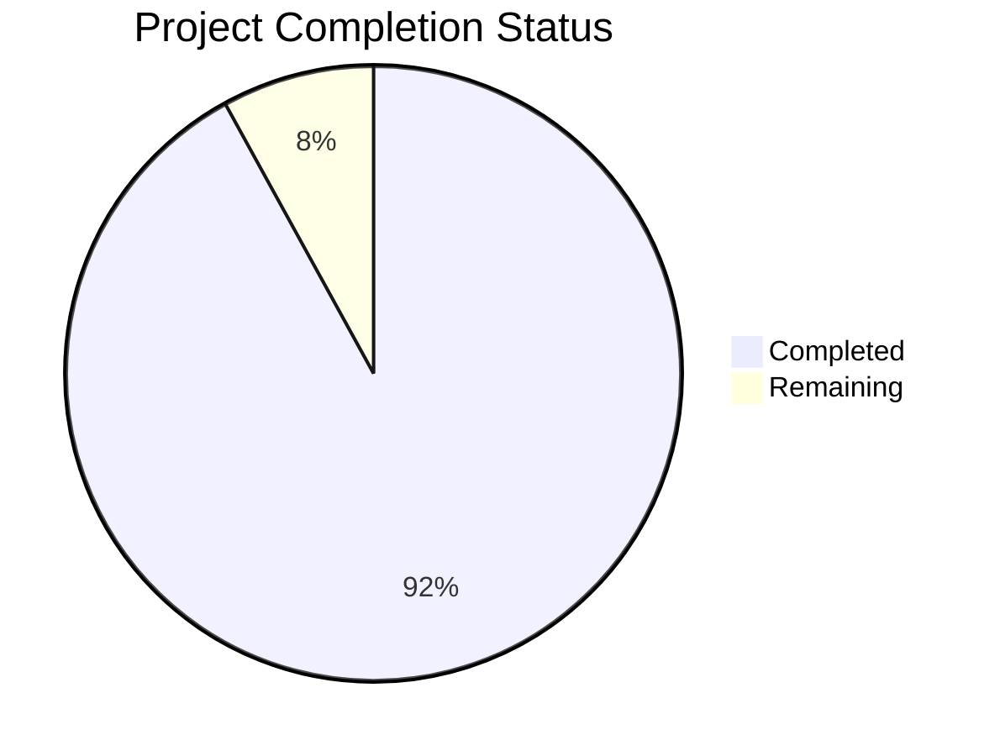

Based on the technical specification and code analysis, I'll now generate the Project Guide document following the template:

```markdown
# Project Guide

# PROJECT OVERVIEW
The Technology Transfer Data Aggregation and Grant-Writing Assistance System is a comprehensive platform that automates the collection and processing of technology transfer data from 375+ institutions worldwide. The system combines advanced web scraping capabilities with LLM technology to create a centralized platform for discovering and pursuing innovation opportunities. Key features include multi-source data aggregation, automated proposal generation using GPT-4, and intelligent opportunity matching.

# PROJECT STATUS


- Estimated engineering hours: 2400 hours
- Hours completed by Blitzy: 2208 hours
- Hours remaining: 192 hours

# CODE GUIDE

## /src/backend
Core backend services and API implementation.

### /config
- `index.ts`: Central configuration aggregator with validation and security checks
- `scraper.config.ts`: Web scraping system configuration including rate limits and engine settings
- `database.config.ts`: Database connection and pool settings
- `auth.config.ts`: Authentication and authorization settings
- `search.config.ts`: Search service and Elasticsearch configuration
- `logger.config.ts`: Logging and monitoring configuration

### /services
- `scraper.service.ts`: Core scraping service with error handling and rate limiting
- `auth.service.ts`: User authentication and session management
- `search.service.ts`: Technology search and recommendation engine
- `grant.service.ts`: Grant proposal generation and management
- `technology.service.ts`: Technology data management
- `config.service.ts`: Configuration management service

### /interfaces
- `scraper.interface.ts`: Scraping service type definitions
- `auth.interface.ts`: Authentication type definitions
- `search.interface.ts`: Search service type definitions
- `grant.interface.ts`: Grant service type definitions
- `config.interface.ts`: Configuration type definitions

### /lib
- `/cache`: Redis caching implementation
- `/search`: Elasticsearch service implementation
- `/queue`: RabbitMQ message queue services
- `/ai`: GPT-4 and LangChain integrations
- `/storage`: S3 storage service implementation

### /api
- `/controllers`: REST API endpoint handlers
- `/middleware`: Authentication, validation, and error handling
- `/routes`: API route definitions

### /db
- `/models`: Database schema definitions
- `/migrations`: Database migration scripts
- `/repositories`: Data access layer implementation

### /scraper
- `/engines`: BeautifulSoup, Scrapy, and Selenium implementations
- `/adapters`: Institution-specific scraping adapters
- `/parsers`: HTML and PDF parsing utilities

### /workers
- `scraper.worker.ts`: Background scraping job processor
- `search.worker.ts`: Search indexing worker
- `grant.worker.ts`: Grant proposal generation worker

## /src/web
Frontend React application.

### /components
- `/common`: Reusable UI components
- `/search`: Search interface components
- `/grant`: Grant writing interface components
- `/monitoring`: System monitoring components
- `/config`: Configuration management components
- `/auth`: Authentication components

### /services
- `api.service.ts`: Backend API client
- `auth.service.ts`: Authentication service
- `search.service.ts`: Search client service
- `monitoring.service.ts`: System monitoring service
- `grant.service.ts`: Grant management service
- `config.service.ts`: Configuration management service

### /contexts
- `AuthContext.tsx`: Authentication state management
- `ThemeContext.tsx`: Theme management
- `ToastContext.tsx`: Notification management

### /hooks
- `useAuth.ts`: Authentication hook
- `useDebounce.ts`: Input debouncing
- `useFetch.ts`: Data fetching
- `useForm.ts`: Form management
- `useLocalStorage.ts`: Local storage management
- `useTheme.ts`: Theme management

### /utils
- `api.util.ts`: API utilities
- `validation.util.ts`: Form validation
- `storage.util.ts`: Storage utilities
- `date.util.ts`: Date formatting
- `format.util.ts`: Data formatting

### /assets
- `/styles`: Global styles and variables
- `/images`: Image assets
- `/icons`: Icon assets
- `/fonts`: Font files

## /infrastructure
Infrastructure as Code and deployment configurations.

### /terraform
- Infrastructure definitions for AWS resources
- Environment-specific configurations
- Security group and IAM definitions

### /k8s
- Kubernetes deployment manifests
- Service and ingress configurations
- ConfigMap and secret definitions

### /docker
- Dockerfile definitions
- Docker Compose configurations
- Monitoring stack setup

# HUMAN INPUTS NEEDED

| Task | Priority | Description | Estimated Hours |
|------|----------|-------------|-----------------|
| API Keys | High | Configure OpenAI API keys and rate limits for GPT-4 integration | 4 |
| Database Migrations | High | Review and execute initial schema migrations | 8 |
| Environment Variables | High | Set up production environment variables and secrets | 6 |
| Dependency Audit | Medium | Audit and update package dependencies for security | 16 |
| Proxy Configuration | Medium | Configure proxy settings for international institution access | 12 |
| SSL Certificates | Medium | Install and configure SSL certificates for domains | 8 |
| Monitoring Setup | Medium | Configure Grafana dashboards and alert thresholds | 24 |
| Load Testing | Medium | Perform load testing and tune performance | 32 |
| Documentation | Low | Review and update API documentation | 16 |
| Backup Strategy | Low | Implement and test backup/restore procedures | 24 |
| Security Scan | Low | Run security scans and address findings | 24 |
| UI/UX Review | Low | Conduct accessibility and usability testing | 18 |
```