# Technical Specifications

# 1. INTRODUCTION

## 1.1 Executive Summary

The Technology Transfer Data Aggregation and Grant-Writing Assistance System addresses the critical need for centralized access to research commercialization opportunities across global institutions. By automating the collection and processing of technology transfer data from 375+ institutions (200 U.S. universities, 100 international universities, and 75 U.S. federal research labs) and providing AI-powered grant writing assistance, the system enables researchers, entrepreneurs, and businesses to efficiently discover and pursue innovation opportunities.

The solution combines advanced web scraping capabilities with large language model (LLM) technology to transform the currently fragmented technology transfer landscape into a streamlined, intelligent platform that matches users with relevant opportunities and automates grant proposal development.

## 1.2 System Overview

### Project Context

| Aspect | Description |
|--------|-------------|
| Market Position | First comprehensive technology transfer aggregation platform with integrated grant-writing capabilities |
| Current Limitations | Manual searching across hundreds of institutional websites, inefficient proposal development process |
| Enterprise Integration | Interfaces with institutional databases, authentication systems, and cloud infrastructure |

### High-Level Description

The system consists of two primary components:

1. **Data Aggregation Engine**
   - Extensible web scraping framework supporting 375+ data sources
   - Automated PDF parsing and structured data extraction
   - Semantic tagging and classification system
   - Centralized data storage and management

2. **Grant-Writing Assistant**
   - Profile-based opportunity matching
   - Automated proposal generation using GPT-4
   - Recommendation scoring system
   - Version-controlled document management

### Success Criteria

| Category | Metrics |
|----------|---------|
| Data Coverage | - 95%+ successful scraping rate across institutions<br>- Complete data extraction for all required fields<br>- Weekly data refresh cycle completion |
| System Performance | - Sub-2 second search response time<br>- 99.9% system uptime<br>- Support for 1000+ concurrent users |
| User Engagement | - 80%+ user satisfaction rate<br>- 50%+ reduction in grant writing time<br>- 30%+ improvement in proposal success rate |

## 1.3 Scope

### In-Scope Elements

| Component | Included Features |
|-----------|------------------|
| Data Collection | - Multi-source web scraping<br>- PDF document parsing<br>- Image/logo collection<br>- Metadata extraction |
| Data Processing | - Semantic classification<br>- Multi-language support<br>- Data validation<br>- Error handling |
| Grant Writing | - Profile matching<br>- Proposal generation<br>- Version control<br>- Collaboration tools |
| Infrastructure | - Cloud deployment<br>- Database management<br>- API interfaces<br>- Security controls |

### Out-of-Scope Elements

- Manual data entry or verification
- Grant submission to institutions
- Financial transaction processing
- Legal document preparation
- Patent application assistance
- Real-time video conferencing
- Mobile application development
- Social media integration
- Third-party marketplace features
- Legacy system migration

# 2. SYSTEM ARCHITECTURE

## 2.1 High-Level Architecture

The system follows a microservices architecture pattern to enable independent scaling, deployment, and maintenance of core functionalities.

```mermaid
C4Context
    title System Context Diagram (Level 0)
    
    Person(user, "User", "Researcher, Entrepreneur, or Business")
    System(system, "Tech Transfer & Grant System", "Data aggregation and grant writing platform")
    System_Ext(universities, "University TTOs", "375+ technology transfer offices")
    System_Ext(labs, "Federal Labs", "75+ research laboratories")
    System_Ext(openai, "OpenAI API", "GPT-4 services")
    System_Ext(auth, "Auth Provider", "Authentication service")
    
    Rel(user, system, "Uses")
    Rel(system, universities, "Scrapes data")
    Rel(system, labs, "Scrapes data")
    Rel(system, openai, "Generates proposals")
    Rel(system, auth, "Authenticates")
    
    UpdateLayoutConfig($c4ShapeInRow: 3, $c4BoundaryInRow: 2)
```

```mermaid
C4Container
    title Container Diagram (Level 1)
    
    Container(web, "Web Application", "React", "User interface")
    Container(api, "API Gateway", "Node.js", "API routing and auth")
    Container(scraper, "Scraping Service", "Python", "Data collection")
    Container(processor, "Data Processor", "Python", "Classification & enrichment")
    Container(writer, "Grant Writer", "Python", "Proposal generation")
    Container(search, "Search Service", "Python", "Semantic search")
    
    ContainerDb(db, "Primary Database", "PostgreSQL", "Structured data")
    ContainerDb(docs, "Document Store", "MongoDB", "Proposals & versions")
    ContainerDb(cache, "Cache", "Redis", "Session & search cache")
    
    Rel(web, api, "Uses", "HTTPS")
    Rel(api, scraper, "Triggers", "gRPC")
    Rel(api, processor, "Requests", "gRPC")
    Rel(api, writer, "Requests", "gRPC")
    Rel(api, search, "Queries", "gRPC")
    
    Rel(scraper, db, "Stores")
    Rel(processor, db, "Reads/Writes")
    Rel(writer, docs, "Stores")
    Rel(search, cache, "Uses")
    
    UpdateLayoutConfig($c4ShapeInRow: 3, $c4BoundaryInRow: 2)
```

## 2.2 Component Details

### 2.2.1 Core Services

| Component | Purpose | Technologies | Scaling Strategy |
|-----------|----------|--------------|------------------|
| API Gateway | Request routing, authentication, rate limiting | Node.js, Express | Horizontal with load balancer |
| Scraping Service | Data collection from institutions | Python, BeautifulSoup, Scrapy | Queue-based with worker pools |
| Data Processor | Classification and enrichment | Python, spaCy, scikit-learn | Horizontal with job distribution |
| Grant Writer | Proposal generation and management | Python, GPT-4 API | Queue-based with priority levels |
| Search Service | Semantic search and recommendations | Python, FAISS, PyTorch | Read replicas with caching |

### 2.2.2 Data Storage

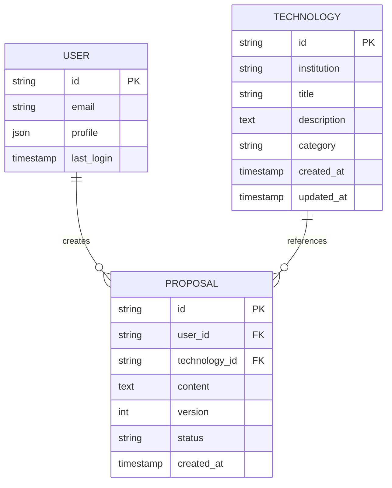

## 2.3 Technical Decisions

### 2.3.1 Architecture Patterns

| Pattern | Implementation | Rationale |
|---------|----------------|-----------|
| Microservices | Independent services with dedicated databases | Enables independent scaling and deployment |
| Event-Driven | RabbitMQ message queues | Asynchronous processing for long-running tasks |
| CQRS | Separate read/write paths | Optimized query performance for search operations |
| Circuit Breaker | Resilience4j implementation | Fault tolerance for external service calls |

### 2.3.2 Data Management

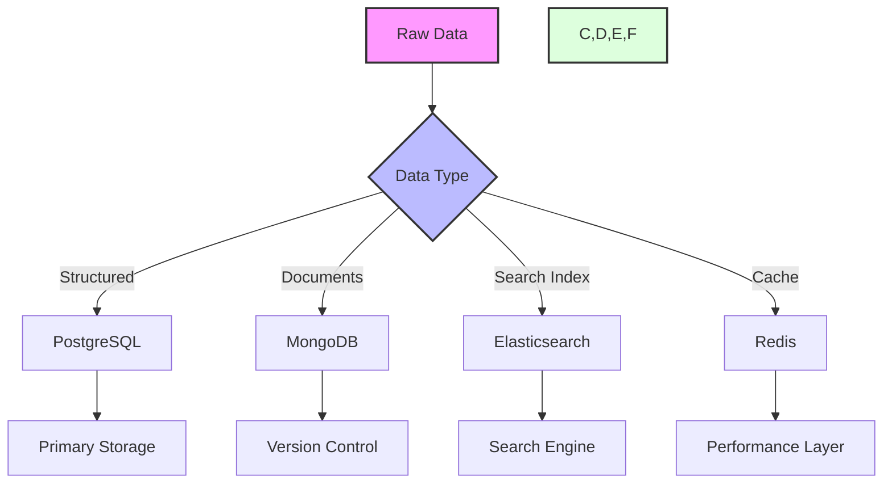

## 2.4 Cross-Cutting Concerns

### 2.4.1 Monitoring and Observability

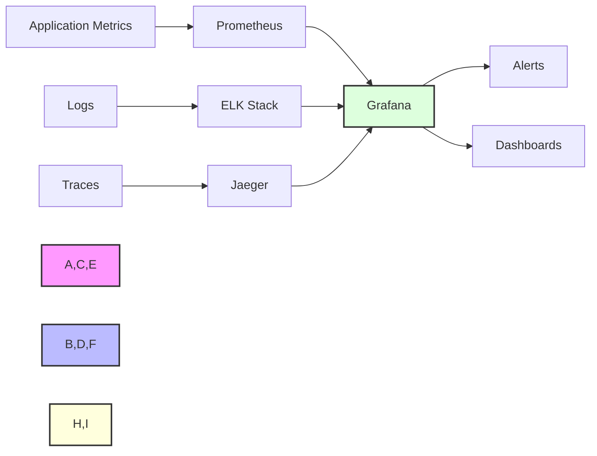

### 2.4.2 Deployment Architecture

```mermaid
C4Deployment
    title Deployment Diagram
    
    Deployment_Node(aws, "AWS Cloud", "Region") {
        Deployment_Node(vpc, "VPC", "Network Isolation") {
            Deployment_Node(eks, "EKS Cluster", "Container Orchestration") {
                Container(api, "API Pods", "Node.js")
                Container(services, "Service Pods", "Python")
                Container(workers, "Worker Pods", "Python")
            }
            
            Deployment_Node(dbs, "Database Cluster", "Data Layer") {
                ContainerDb(rds, "RDS", "PostgreSQL")
                ContainerDb(mongo, "DocumentDB", "MongoDB")
                ContainerDb(redis, "ElastiCache", "Redis")
            }
        }
    }
    
    Rel(api, services, "Uses")
    Rel(services, workers, "Delegates")
    Rel(services, dbs, "Persists")
    
    UpdateLayoutConfig($c4ShapeInRow: 3)
```

# 3. SYSTEM COMPONENTS ARCHITECTURE

## 3.1 User Interface Design

### 3.1.1 Command Line Interface

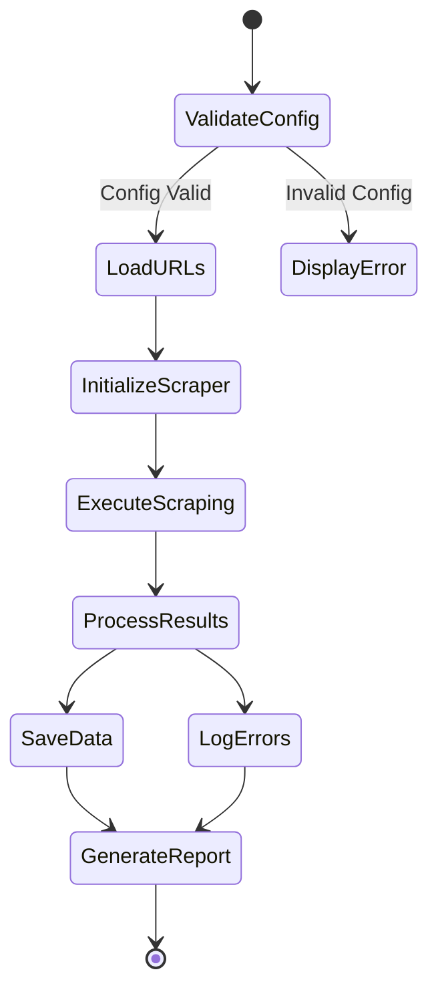

| Component | Specification |
|-----------|--------------|
| Command Structure | `scraper [command] [options]`<br>Commands: start, validate, report<br>Options: --config, --output, --verbose |
| Input Validation | - Config file existence and format<br>- URL format and accessibility<br>- Output directory permissions<br>- Rate limit parameters |
| Output Formatting | - Structured JSON logs<br>- CSV data output<br>- Progress indicators<br>- Error summaries |
| Error Handling | - Detailed error messages<br>- Stack traces in debug mode<br>- Warning levels<br>- Recovery suggestions |

### 3.1.2 Configuration Interface

```yaml
# URL Configuration Schema
version: "1.0"
refresh_interval: 14 # days
rate_limits:
  requests_per_second: 2
  max_concurrent: 5
institutions:
  universities:
    us:
      - name: "Stanford University"
        url: "https://techfinder.stanford.edu/"
        type: "html"
        selectors:
          title: ".tech-title"
          description: ".tech-description"
    international:
      - name: "Oxford University"
        url: "https://innovation.ox.ac.uk/technologies-available/"
  federal_labs:
    - name: "NASA"
      url: "https://technology.nasa.gov/patents"
```

## 3.2 Database Design

### 3.2.1 Schema Design

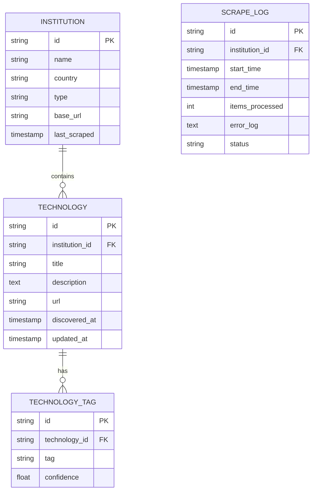

### 3.2.2 Data Management Strategy

| Aspect | Implementation |
|--------|---------------|
| Storage Engine | PostgreSQL with TimescaleDB extension |
| Partitioning | Time-based partitioning on discovery_date |
| Indexing | - B-tree on institution_id, technology_id<br>- GiST index on description for full-text search<br>- Hash index on URLs |
| Archival | - Monthly aggregation of scrape logs<br>- Yearly archival of inactive technologies<br>- Compressed storage for historical data |
| Backup | - Daily incremental backups<br>- Weekly full backups<br>- 30-day retention period |

## 3.3 API Design

### 3.3.1 Internal API Architecture

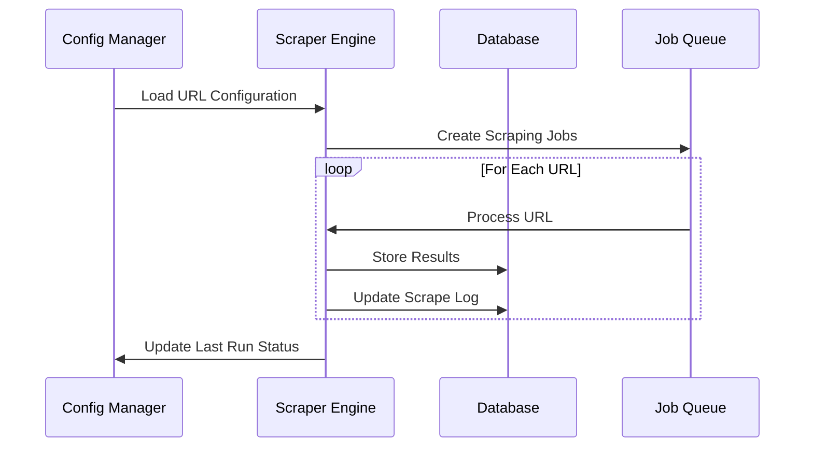

### 3.3.2 Service Interfaces

| Interface | Specification |
|-----------|---------------|
| Configuration | - REST API for URL management<br>- CRUD operations for institution records<br>- Batch update capabilities<br>- Version control for configurations |
| Scraper Engine | - Job queue interface<br>- Progress reporting endpoints<br>- Error notification webhooks<br>- Rate limit controls |
| Data Access | - Read-only data API<br>- Filtering and pagination<br>- Bulk export capabilities<br>- Change notification streams |

### 3.3.3 Integration Points

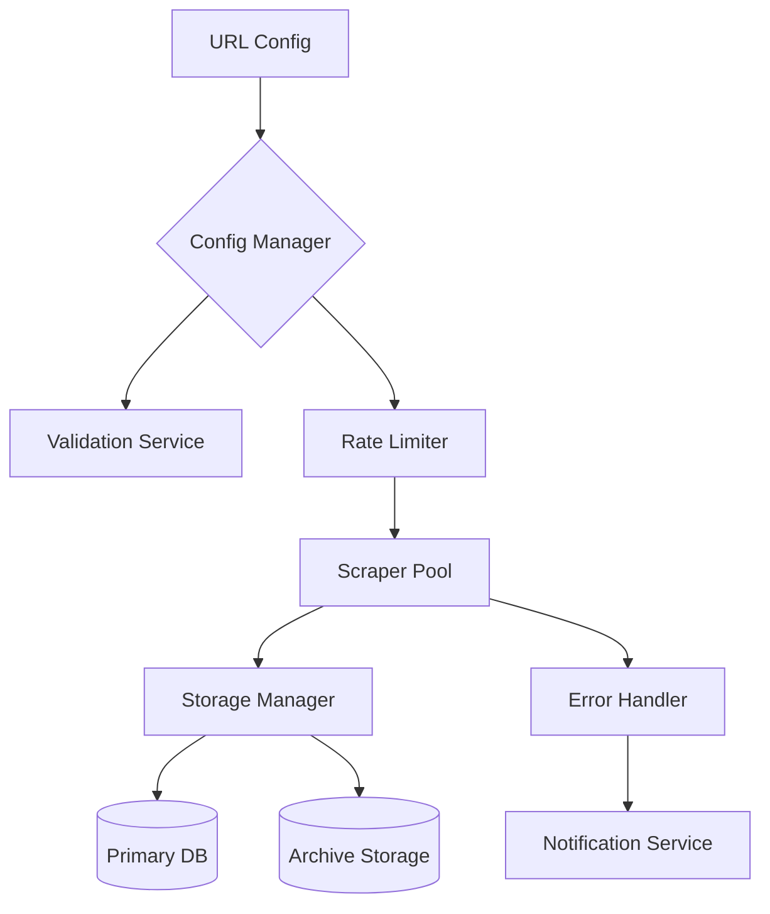

| Component | Integration Requirements |
|-----------|------------------------|
| Config Manager | - File system access<br>- Version control integration<br>- Change notification system |
| Scraper Engine | - HTTP client library<br>- HTML parsing tools<br>- Rate limiting middleware |
| Storage Layer | - Database connection pool<br>- Caching system<br>- Backup service integration |
| Error Handling | - Logging service<br>- Monitoring system<br>- Alert management |

# 4. TECHNOLOGY STACK

## 4.1 PROGRAMMING LANGUAGES

| Platform/Component | Language | Version | Justification |
|-------------------|----------|---------|---------------|
| Core Scraping Engine | Python | 3.8+ | - Native support for BeautifulSoup and Scrapy<br>- Extensive data processing libraries<br>- Strong async capabilities |
| API Services | Python | 3.8+ | - Consistency with scraping engine<br>- FastAPI integration<br>- High performance with async/await |
| Data Processing | Python | 3.8+ | - Pandas/NumPy ecosystem<br>- ML/NLP library support<br>- Efficient data manipulation |
| Build Scripts | Python | 3.8+ | - Maintain ecosystem consistency<br>- Cross-platform compatibility<br>- Rich DevOps tooling |

## 4.2 FRAMEWORKS & LIBRARIES

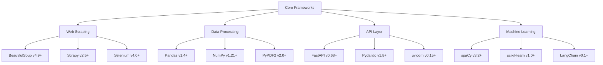

### Core Dependencies

| Category | Component | Version | Purpose |
|----------|-----------|---------|----------|
| Web Scraping | BeautifulSoup | 4.9+ | HTML parsing |
| Web Scraping | Scrapy | 2.5+ | Large-scale scraping |
| Web Scraping | Selenium | 4.0+ | Dynamic content |
| Data Processing | Pandas | 1.4+ | Data manipulation |
| Data Processing | NumPy | 1.21+ | Numerical operations |
| API | FastAPI | 0.68+ | REST API framework |
| Machine Learning | spaCy | 3.2+ | NLP processing |
| Machine Learning | LangChain | 0.1+ | LLM integration |

## 4.3 DATABASES & STORAGE

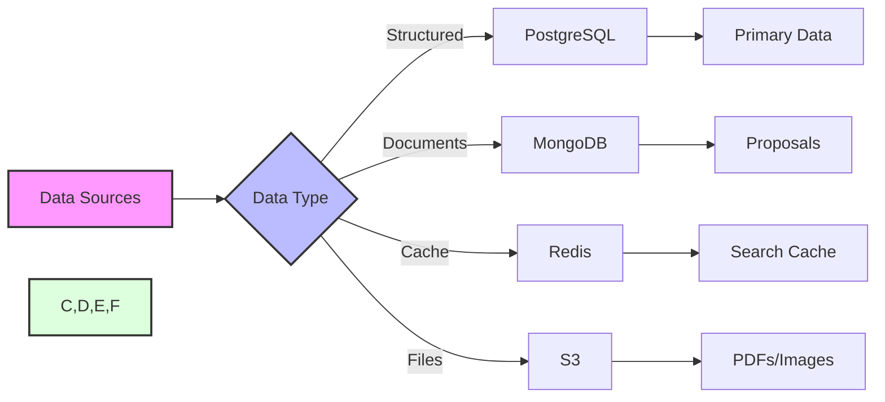

| Storage Type | Technology | Purpose | Configuration |
|--------------|------------|---------|---------------|
| Primary Database | PostgreSQL 14+ | Structured data storage | - TimescaleDB extension<br>- Partitioning by institution<br>- Full-text search |
| Document Store | MongoDB 5+ | Proposal storage | - Sharded clusters<br>- WiredTiger storage<br>- Version control |
| Cache Layer | Redis 6+ | Search/session cache | - Cluster mode<br>- Persistence enabled<br>- Eviction policies |
| Object Storage | AWS S3 | Static assets | - Versioning enabled<br>- Lifecycle policies<br>- CDN integration |

## 4.4 THIRD-PARTY SERVICES

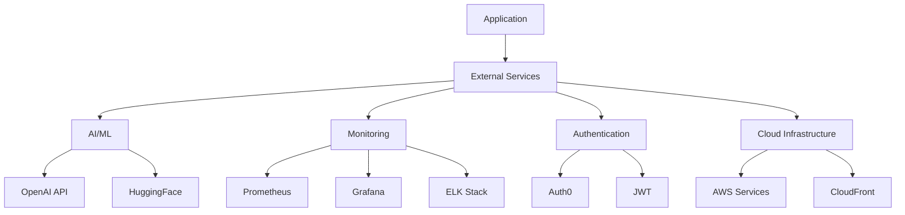

| Service Category | Provider | Purpose | Integration |
|-----------------|----------|----------|-------------|
| AI Services | OpenAI | LLM capabilities | GPT-4 API |
| Monitoring | Prometheus/Grafana | System metrics | Exporters |
| Logging | ELK Stack | Log aggregation | Filebeat |
| Authentication | Auth0 | User management | OAuth 2.0 |
| Cloud Services | AWS | Infrastructure | SDK/API |

## 4.5 DEVELOPMENT & DEPLOYMENT

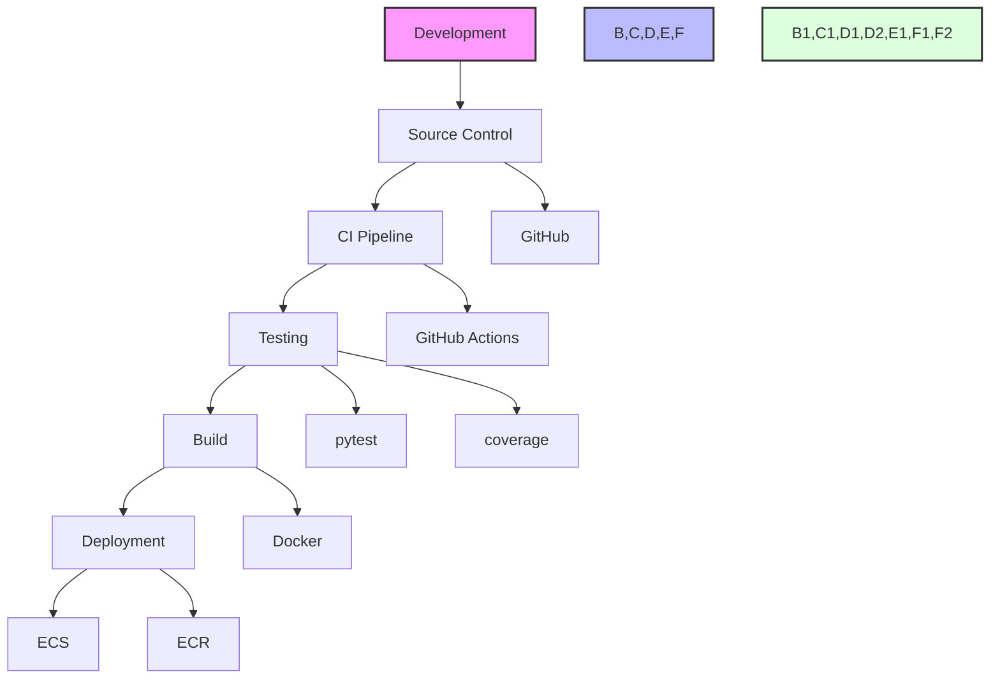

| Category | Tool | Version | Purpose |
|----------|------|---------|----------|
| Version Control | Git | 2.30+ | Source management |
| CI/CD | GitHub Actions | Latest | Automation |
| Containerization | Docker | 20.10+ | Application packaging |
| Container Registry | AWS ECR | Latest | Image storage |
| Orchestration | AWS ECS | Latest | Container management |
| IaC | Terraform | 1.0+ | Infrastructure management |

## 5. SYSTEM DESIGN

### 5.1 URL Configuration Management

#### 5.1.1 Configuration File Structure

```yaml
# urls_config.yaml
version: "1.0"
last_updated: "2024-02-20"
refresh_interval_days: 14

institutions:
  universities:
    us:
      - name: "Stanford University"
        url: "https://techfinder.stanford.edu/"
        type: "html"
        active: true
        selectors:
          title: ".tech-title"
          description: ".tech-description"
          pagination: ".pagination"
        rate_limit: 2  # requests per second
    international:
      - name: "Oxford University"
        url: "https://innovation.ox.ac.uk/technologies-available/"
        type: "html"
        active: true
        selectors:
          title: ".technology-title"
          description: ".tech-details"
  federal_labs:
    - name: "NASA"
      url: "https://technology.nasa.gov/patents"
      type: "api"
      active: true
      api_key_env: "NASA_API_KEY"
      rate_limit: 5
```

#### 5.1.2 Configuration Management Flow

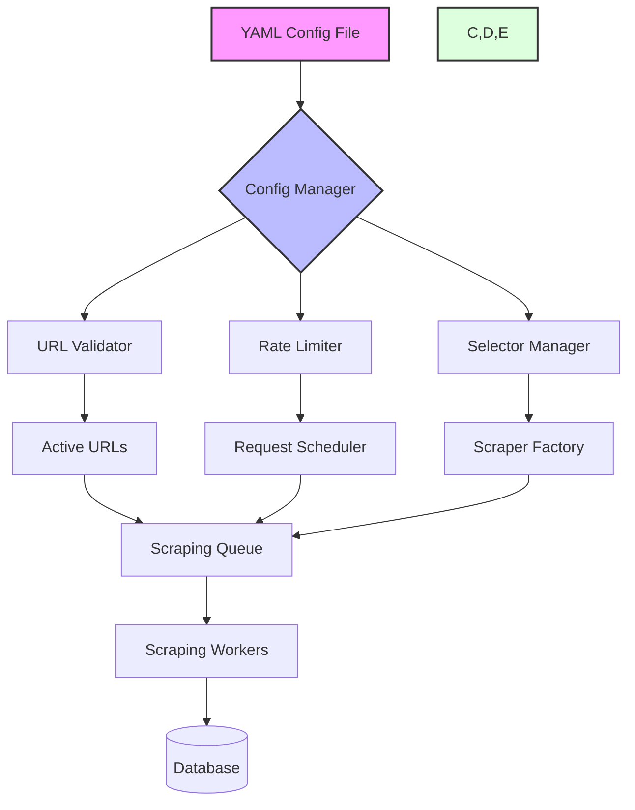

### 5.2 Command Line Interface Design

```markdown
# CLI Interface Structure

scraper_manager.py [command] [options]

Commands:
  validate   - Validate URL configuration file
  refresh    - Run full refresh cycle
  status     - Check scraping status
  add        - Add new URL to configuration
  update     - Update existing URL configuration
  disable    - Disable URL in configuration

Options:
  --config   - Path to config file (default: config/urls.yaml)
  --output   - Output directory (default: data/tech/)
  --verbose  - Enable detailed logging
  --workers  - Number of parallel workers (default: 4)
```

### 5.3 Database Design

#### 5.3.1 Schema Design

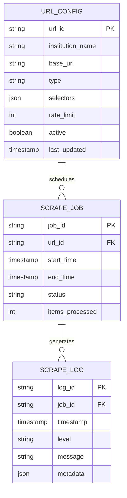

#### 5.3.2 Indexes and Constraints

| Table | Index | Type | Purpose |
|-------|-------|------|---------|
| URL_CONFIG | url_id | Primary | Unique identifier |
| URL_CONFIG | base_url | Unique | Prevent duplicates |
| SCRAPE_JOB | job_id | Primary | Unique identifier |
| SCRAPE_JOB | url_id, start_time | Composite | Job lookup |
| SCRAPE_LOG | log_id | Primary | Unique identifier |
| SCRAPE_LOG | job_id, timestamp | Composite | Log retrieval |

### 5.4 API Design

#### 5.4.1 Internal Service Interfaces

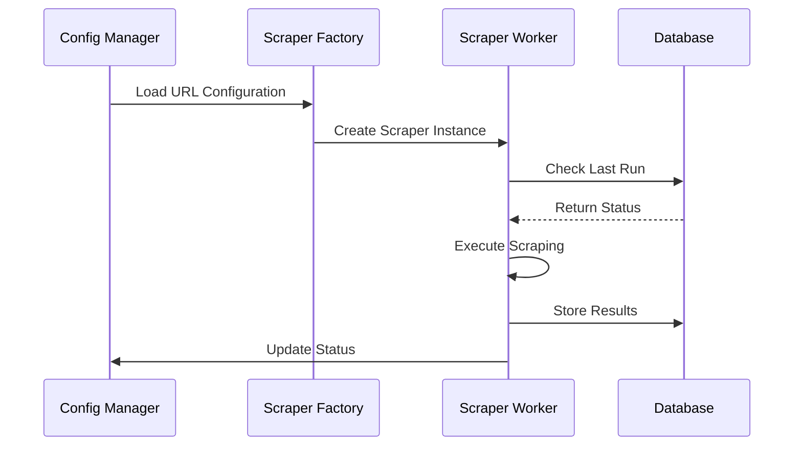

#### 5.4.2 Service Endpoints

| Endpoint | Method | Purpose | Parameters |
|----------|--------|---------|------------|
| /config/validate | POST | Validate configuration | config_file: YAML |
| /config/urls | GET | List active URLs | filter: string |
| /config/urls | POST | Add new URL | url_config: JSON |
| /jobs/status | GET | Get job status | job_id: string |
| /jobs/start | POST | Start scraping job | url_id: string |
| /logs | GET | Get scraping logs | job_id: string |

### 5.5 Error Handling and Recovery

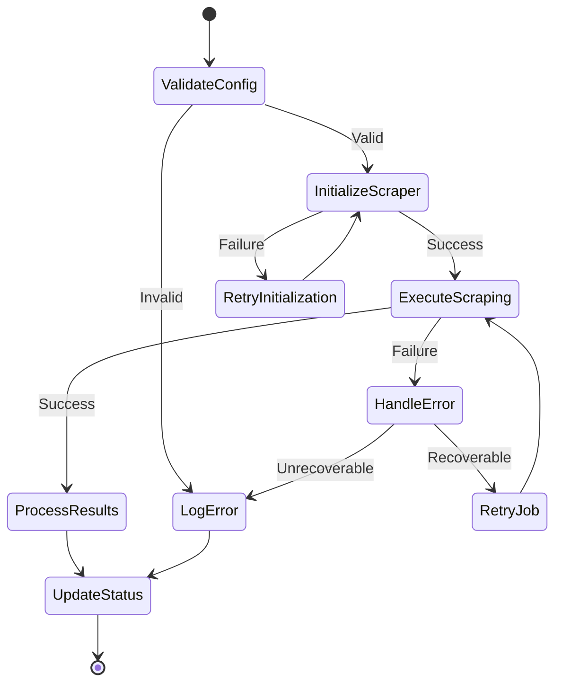

# 6. USER INTERFACE DESIGN

## 6.1 URL Configuration Interface

### 6.1.1 URL Management Dashboard

```
+----------------------------------------------------------+
|  URL Configuration Dashboard                    [@] [=] [?] |
+----------------------------------------------------------+
| [+] Add URL  [^] Import URLs  [Export] [Save]             |
|----------------------------------------------------------|
| Search: [...............................] [Filter v]        |
|----------------------------------------------------------|
| Institution URLs                        Status    Actions  |
|----------------------------------------------------------|
| [x] Stanford University                 [Active]  [Edit]   |
|  +-- https://techfinder.stanford.edu/   [====]   [Test]   |
|                                                           |
| [x] MIT                                [Active]  [Edit]   |
|  +-- https://tlo.mit.edu/              [====]   [Test]   |
|                                                           |
| [x] Harvard University                  [Error!]  [Edit]   |
|  +-- https://otd.harvard.edu/          [==  ]   [Test]   |
|                                                           |
| Total URLs: 375/400                    [Next >]           |
+----------------------------------------------------------+
| [!] 3 URLs require attention                              |
+----------------------------------------------------------+
```

### 6.1.2 Add/Edit URL Form

```
+----------------------------------------------------------+
|  Add/Edit URL Configuration                    [x] [?]     |
+----------------------------------------------------------+
| Institution Details                                        |
|----------------------------------------------------------|
| Name:        [..............................]             |
| Country:     [United States v]                            |
| Type:        (•) University ( ) Federal Lab ( ) Int'l     |
|----------------------------------------------------------|
| URL Configuration                                         |
|----------------------------------------------------------|
| Base URL:    [..............................]             |
| Active:      [x]                                          |
|----------------------------------------------------------|
| Scraping Settings                                         |
|----------------------------------------------------------|
| Rate Limit:  [2] requests/second                          |
| Selectors:                                                |
|  Title:      [..............................]             |
|  Description:[..............................]             |
|  Links:      [..............................]             |
|----------------------------------------------------------|
| [Test Connection]  [Save]  [Cancel]                       |
+----------------------------------------------------------+
```

### 6.1.3 Batch Import Interface

```
+----------------------------------------------------------+
|  Batch URL Import                              [x] [?]     |
+----------------------------------------------------------+
| Import Method                                              |
|----------------------------------------------------------|
| ( ) CSV Upload   [Choose File]                            |
| ( ) Paste URLs   +-------------------------+              |
|                  |                         |              |
|                  | URL list here...        |              |
|                  |                         |              |
|                  +-------------------------+              |
|----------------------------------------------------------|
| Validation                                                |
|----------------------------------------------------------|
| [x] Check URL accessibility                               |
| [x] Verify format compliance                              |
| [x] Detect duplicates                                     |
|----------------------------------------------------------|
| [Validate] [Import] [Cancel]                              |
+----------------------------------------------------------+
```

### 6.1.4 URL Testing Dashboard

```
+----------------------------------------------------------+
|  URL Testing Results                           [x] [?]     |
+----------------------------------------------------------+
| Test Summary                        Last Run: 2024-02-20   |
|----------------------------------------------------------|
| Total URLs:     375    [====] 100%                        |
| Successful:     362    [====-] 96%                        |
| Failed:         13     [=---] 4%                          |
|----------------------------------------------------------|
| Failed URLs                                     Actions    |
|----------------------------------------------------------|
| [!] Harvard University                                    |
|     Error: Rate limit exceeded                 [Retry]     |
|                                                           |
| [!] Stanford University                                   |
|     Error: Invalid selector                   [Edit]      |
|                                                           |
| [!] MIT                                                   |
|     Error: Connection timeout                 [Retry]     |
|----------------------------------------------------------|
| [Export Report] [Schedule Retest] [Close]                 |
+----------------------------------------------------------+
```

## 6.2 Interface Components Key

### Navigation Icons
- [@] User profile/account
- [=] Settings menu
- [?] Help/documentation
- [x] Close/remove
- [<] [>] Previous/next navigation

### Status Indicators
- [====] Progress bar (full)
- [==--] Progress bar (partial)
- [!] Warning/error alert
- [Active] Status label
- [Error!] Error status

### Input Controls
- [...] Text input field
- [x] Checkbox
- ( ) Radio button
- [v] Dropdown menu
- [Choose File] File upload button

### Action Buttons
- [+] Add new item
- [^] Import/upload
- [Test] Test connection
- [Save] Save changes
- [Export] Export data
- [Cancel] Cancel operation
- [Retry] Retry failed operation

### Layout Elements
- +--+ Border corners
- |--| Horizontal dividers
- +-- Tree view hierarchy
- |  | Vertical dividers

## 6.3 Responsive Design Considerations

The interface will adapt to different screen sizes with the following breakpoints:

| Screen Size | Layout Adjustments |
|-------------|-------------------|
| Desktop (>1200px) | Full layout as shown in wireframes |
| Tablet (768-1199px) | Condensed navigation, scrollable tables |
| Mobile (<767px) | Single column layout, collapsible sections |

## 6.4 Accessibility Features

- ARIA labels for all interactive elements
- Keyboard navigation support
- High contrast mode support
- Screen reader compatibility
- Color-blind friendly status indicators
- Scalable text and components

## 6.5 Error Handling

The interface will display errors using:
- Modal dialogs for critical errors
- Inline validation messages
- Status indicators in lists
- Toast notifications for background operations
- Detailed error logs in testing dashboard

# 7. SECURITY CONSIDERATIONS

## 7.1 AUTHENTICATION AND AUTHORIZATION

### 7.1.1 Authentication Flow

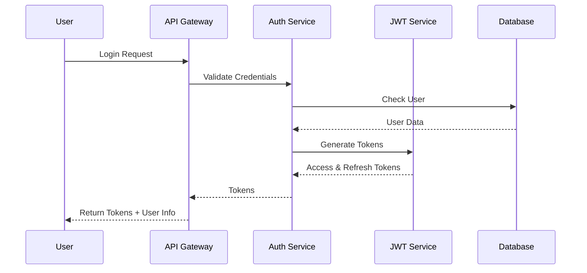

### 7.1.2 Authorization Matrix

| Role | URL Management | Scraping Control | Data Access | System Config |
|------|---------------|------------------|-------------|---------------|
| Admin | Full Access | Full Control | Full Access | Full Access |
| Manager | Read/Write | Start/Stop | Read/Write | Read Only |
| Analyst | Read Only | View Status | Read Only | No Access |
| API User | No Access | No Access | Read Only | No Access |

## 7.2 DATA SECURITY

### 7.2.1 Data Protection Measures

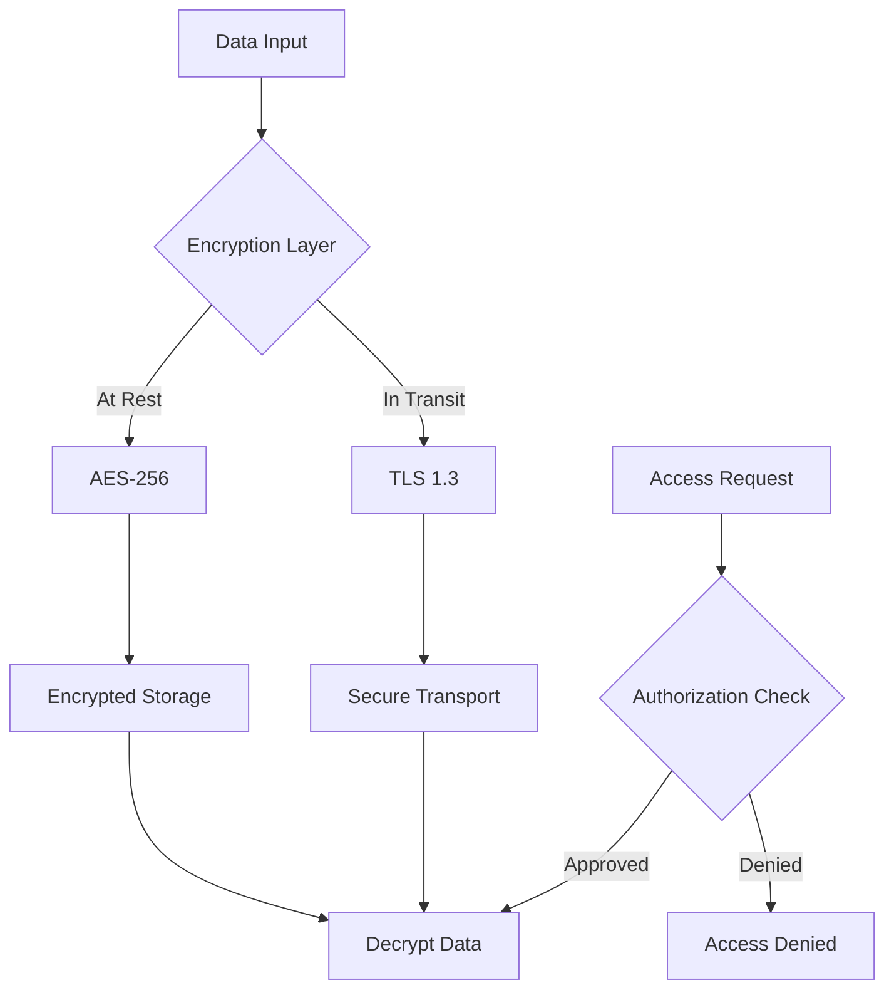

### 7.2.2 Data Classification

| Data Type | Classification | Protection Level | Encryption | Backup Frequency |
|-----------|---------------|------------------|------------|------------------|
| URL Configurations | Sensitive | High | AES-256 | Daily |
| Scraped Technology Data | Public | Medium | TLS in Transit | Weekly |
| User Credentials | Critical | Highest | Argon2 Hash | Real-time |
| System Logs | Internal | Medium | AES-256 | Daily |

## 7.3 SECURITY PROTOCOLS

### 7.3.1 Network Security

```mermaid
flowchart LR
    A[Internet] --> B[WAF]
    B --> C[Load Balancer]
    C --> D[API Gateway]
    D --> E[VPC]
    
    subgraph Virtual Private Cloud
    E --> F[Application Tier]
    F --> G[Database Tier]
    end
    
    H[Monitoring] --> E
    I[Backup Service] --> G
```

### 7.3.2 Security Controls

| Control Type | Implementation | Update Frequency | Monitoring |
|--------------|----------------|------------------|------------|
| WAF Rules | AWS WAF | Weekly | Real-time |
| API Rate Limiting | 1000 req/min | Dynamic | Per-minute |
| IP Whitelisting | Configurable | As needed | Real-time |
| Session Management | Redis + JWT | 24hr expiry | Per-session |

### 7.3.3 Compliance Requirements

| Requirement | Implementation | Validation |
|-------------|----------------|------------|
| Access Logging | CloudWatch Logs | Daily Audit |
| Data Retention | 90-day rolling | Monthly Check |
| Encryption Standards | FIPS 140-2 | Quarterly Audit |
| Security Updates | Automated patching | Weekly |

### 7.3.4 Incident Response

```mermaid
stateDiagram-v2
    [*] --> Monitoring
    Monitoring --> Detection: Alert Triggered
    Detection --> Analysis: Security Event
    Analysis --> Response: Threat Confirmed
    Response --> Mitigation: Action Required
    Mitigation --> Recovery: Threat Contained
    Recovery --> Documentation: System Restored
    Documentation --> Monitoring: Incident Closed
```

### 7.3.5 Security Monitoring

| Component | Monitoring Tool | Alert Threshold | Response Time |
|-----------|----------------|-----------------|---------------|
| API Gateway | CloudWatch | 5xx > 1% | 5 minutes |
| Database | RDS Monitoring | CPU > 80% | 10 minutes |
| Network | VPC Flow Logs | Suspicious Pattern | Immediate |
| Application | ELK Stack | Error Rate > 5% | 15 minutes |

# 8. INFRASTRUCTURE

## 8.1 DEPLOYMENT ENVIRONMENT

The system will be deployed on AWS cloud infrastructure to ensure scalability, reliability, and global accessibility. This cloud-native approach enables efficient handling of distributed scraping workloads and provides robust data storage capabilities.

| Environment | Purpose | Configuration |
|-------------|----------|---------------|
| Development | Local development and testing | Docker containers on developer machines |
| Staging | Pre-production testing | AWS ECS with reduced capacity |
| Production | Live system | AWS ECS with auto-scaling |

## 8.2 CLOUD SERVICES

```mermaid
flowchart TD
    A[AWS Cloud Infrastructure] --> B[Compute]
    A --> C[Storage]
    A --> D[Database]
    A --> E[Security]
    A --> F[Networking]

    B --> B1[ECS/Fargate]
    B --> B2[Lambda]
    
    C --> C1[S3]
    C --> C2[EFS]
    
    D --> D1[RDS PostgreSQL]
    D --> D2[DocumentDB]
    D --> D3[ElastiCache]
    
    E --> E1[IAM]
    E --> E2[KMS]
    E --> E3[WAF]
    
    F --> F1[VPC]
    F --> F2[CloudFront]
    F --> F3[Route 53]
```

| Service | Purpose | Configuration |
|---------|---------|---------------|
| ECS/Fargate | Container orchestration | Serverless compute for scrapers |
| Lambda | Serverless functions | URL validation and monitoring |
| S3 | Object storage | PDF and image storage |
| RDS PostgreSQL | Primary database | Multi-AZ deployment |
| DocumentDB | Document storage | Proposal versioning |
| ElastiCache | Caching layer | Redis for session data |

## 8.3 CONTAINERIZATION

Docker containers are used to ensure consistent environments across development and production:

```mermaid
graph LR
    A[Base Image] --> B[Python 3.8]
    B --> C[Scraper Image]
    B --> D[API Image]
    B --> E[Worker Image]
    
    C --> F[Scraper Container]
    D --> G[API Container]
    E --> H[Worker Container]
    
    style A fill:#f9f,stroke:#333,stroke-width:2px
    style B fill:#bbf,stroke:#333,stroke-width:2px
    style C,D,E fill:#dfd,stroke:#333,stroke-width:2px
    style F,G,H fill:#ffd,stroke:#333,stroke-width:2px
```

| Component | Base Image | Key Dependencies |
|-----------|------------|------------------|
| Scraper | python:3.8-slim | BeautifulSoup, Scrapy, Selenium |
| API | python:3.8-slim | FastAPI, uvicorn |
| Worker | python:3.8-slim | Celery, Redis |

## 8.4 ORCHESTRATION

Kubernetes is used via AWS ECS for container orchestration:

```mermaid
flowchart TD
    A[ECS Cluster] --> B[Scraper Service]
    A --> C[API Service]
    A --> D[Worker Service]
    
    B --> B1[Task Definition]
    B --> B2[Auto Scaling]
    
    C --> C1[Task Definition]
    C --> C2[Load Balancer]
    
    D --> D1[Task Definition]
    D --> D2[Queue Processing]
    
    B1 --> E[Fargate Tasks]
    C1 --> E
    D1 --> E
```

| Service | Scaling Policy | Resources |
|---------|---------------|------------|
| Scraper | CPU utilization > 70% | 1 vCPU, 2GB RAM |
| API | Request count based | 2 vCPU, 4GB RAM |
| Worker | Queue length based | 1 vCPU, 2GB RAM |

## 8.5 CI/CD PIPELINE

```mermaid
flowchart LR
    A[GitHub] --> B[GitHub Actions]
    B --> C{Tests Pass?}
    C -->|Yes| D[Build Images]
    C -->|No| E[Notify Team]
    D --> F[Push to ECR]
    F --> G[Deploy to ECS]
    G --> H[Health Check]
    H -->|Pass| I[Complete]
    H -->|Fail| J[Rollback]
    
    style C fill:#bbf,stroke:#333,stroke-width:2px
    style E,J fill:#f9f,stroke:#333,stroke-width:2px
    style I fill:#dfd,stroke:#333,stroke-width:2px
```

| Stage | Tools | Actions |
|-------|-------|---------|
| Source Control | GitHub | Code versioning, PR reviews |
| CI | GitHub Actions | Testing, linting, security scans |
| Build | Docker | Image creation and tagging |
| Registry | ECR | Image storage and versioning |
| CD | AWS CodeDeploy | Blue-green deployment |
| Monitoring | CloudWatch | Performance and health metrics |

### Pipeline Stages

1. **Code Commit**
   - Branch protection rules
   - Required reviews
   - Automated testing

2. **Build & Test**
   - Unit tests
   - Integration tests
   - Security scanning
   - Docker image building

3. **Deployment**
   - Staging environment deployment
   - Production deployment
   - Health checks
   - Automated rollback

4. **Monitoring**
   - Performance metrics
   - Error tracking
   - Resource utilization
   - Cost optimization

# APPENDICES

## A.1 URL Configuration Schema

```yaml
# urls_config.yaml
version: "2.0"
last_updated: "2024-02-20"
refresh_interval_days: 14

institutions:
  us_universities:
    - name: "Stanford University"
      url: "https://techfinder.stanford.edu/"
      type: "html"
      active: true
      selectors:
        title: ".tech-title"
        description: ".tech-description"
        pagination: ".pagination"
      rate_limit: 2
      
  international_universities:
    - name: "Oxford University"
      url: "https://innovation.ox.ac.uk/technologies-available/"
      type: "html"
      active: true
      selectors:
        title: ".technology-title"
        description: ".tech-details"
      rate_limit: 1
      
  federal_labs:
    - name: "NASA"
      url: "https://technology.nasa.gov/patents"
      type: "api"
      active: true
      api_key_env: "NASA_API_KEY"
      rate_limit: 5
```

## A.2 GLOSSARY

| Term | Definition |
|------|------------|
| Content Delivery Network (CDN) | A geographically distributed network of proxy servers to provide high availability and performance |
| Embeddings | Vector representations of text that capture semantic meaning for machine learning models |
| Rate Limiting | The practice of controlling the number of requests a client can make to a service in a given timeframe |
| Semantic Tagging | Process of automatically categorizing content based on its meaning using NLP |
| Technology Transfer | The process of transferring scientific findings from research institutions to commercial applications |
| Web Scraping | Automated extraction of data from websites using specialized software tools |
| Webhook | HTTP callbacks that occur when something happens; a way for apps to provide real-time information |

## A.3 ACRONYMS

| Acronym | Definition |
|---------|------------|
| API | Application Programming Interface |
| AWS | Amazon Web Services |
| CCPA | California Consumer Privacy Act |
| CRUD | Create, Read, Update, Delete |
| CSV | Comma-Separated Values |
| ECS | Elastic Container Service |
| ECR | Elastic Container Registry |
| GDPR | General Data Protection Regulation |
| GPT | Generative Pre-trained Transformer |
| HTML | HyperText Markup Language |
| HTTP | HyperText Transfer Protocol |
| IAM | Identity and Access Management |
| JSON | JavaScript Object Notation |
| JWT | JSON Web Token |
| KMS | Key Management Service |
| LLM | Large Language Model |
| NLP | Natural Language Processing |
| PDF | Portable Document Format |
| REST | Representational State Transfer |
| S3 | Simple Storage Service |
| SDK | Software Development Kit |
| SQL | Structured Query Language |
| SSL | Secure Sockets Layer |
| TLS | Transport Layer Security |
| TTO | Technology Transfer Office |
| URL | Uniform Resource Locator |
| VPC | Virtual Private Cloud |
| WAF | Web Application Firewall |
| YAML | YAML Ain't Markup Language |

## A.4 Additional Technical Information

### A.4.1 Scraping Workflow

```mermaid
stateDiagram-v2
    [*] --> LoadConfig
    LoadConfig --> ValidateURLs
    ValidateURLs --> InitializeScraper: Valid URLs
    ValidateURLs --> LogError: Invalid URLs
    
    InitializeScraper --> ProcessQueue
    ProcessQueue --> ScrapeSite: Available Slot
    ProcessQueue --> WaitForSlot: Rate Limited
    
    WaitForSlot --> ProcessQueue
    ScrapeSite --> ExtractData
    ExtractData --> SaveResults
    ExtractData --> HandleError: Failure
    
    HandleError --> RetryLogic
    RetryLogic --> ScrapeSite: Retry Available
    RetryLogic --> LogError: Max Retries
    
    SaveResults --> UpdateStatus
    LogError --> UpdateStatus
    UpdateStatus --> ProcessQueue: More Sites
    UpdateStatus --> GenerateReport: Complete
    
    GenerateReport --> [*]
```

### A.4.2 Rate Limiting Configuration

| Institution Type | Default Rate (req/sec) | Burst Limit | Cooldown Period |
|-----------------|------------------------|-------------|-----------------|
| US Universities | 2 | 5 | 60s |
| International Universities | 1 | 3 | 120s |
| Federal Labs | 5 | 10 | 30s |
| Default | 1 | 2 | 300s |

### A.4.3 Error Classification Matrix

| Error Type | Retry Strategy | Logging Level | Alert Threshold |
|------------|---------------|---------------|-----------------|
| Network Timeout | Exponential backoff | WARNING | 3 consecutive |
| Rate Limited | Fixed delay | INFO | 5 per hour |
| Parse Error | No retry | ERROR | 1 per site |
| Authentication | Manual intervention | CRITICAL | Immediate |
| Data Validation | Conditional retry | WARNING | 10 per run |